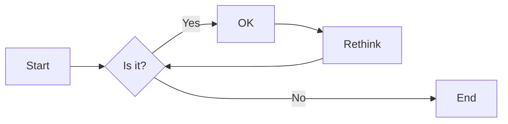
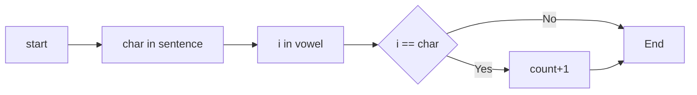
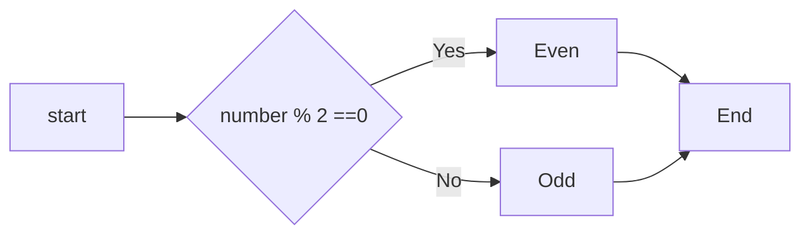

# 实验二 Python变量、简单数据类型

班级： 21计科3班

学号： B20210302326

姓名： 李俊瑜

Github地址：<https://gitee.com/Yukilm/python_exp>

CodeWars地址：<https://www.codewars.com/users/Yukilim>

---

## 实验目的

1. 使用VSCode编写和运行Python程序
2. 学习Python变量和简单数据类型

## 实验环境

1. Git
2. Python 3.10
3. VSCode
4. VSCode插件

## 实验内容和步骤

### 第一部分

实验环境的安装

1. 安装Python，从Python官网下载Python 3.10安装包，下载后直接点击可以安装：[Python官网地址](https://www.python.org/downloads/)
2. 为了在VSCode集成环境下编写和运行Python程序，安装下列VScode插件
   - Python
   - Python Environment Manager
   - Python Indent
   - Python Extended
   - Python Docstring Generator
   - Jupyter
   - indent-rainbow
   - Jinja

---

### 第二部分

Python变量、简单数据类型和列表简介

完成教材《Python编程从入门到实践》下列章节的练习：
- 第2章 变量和简单数据类型
---

### 第三部分

在[Codewars网站](https://www.codewars.com)注册账号，完成下列Kata挑战：

---

#### 第1题：求离整数n最近的平方数（Find Nearest square number）

难度：8kyu

你的任务是找到一个正整数n的最近的平方数
例如，如果n=111，那么nearest_sq(n)（nearestSq(n)）等于121，因为111比100（10的平方）更接近121（11的平方）。
如果n已经是完全平方（例如n=144，n=81，等等），你需要直接返回n。
代码提交地址
<https://www.codewars.com/kata/5a805d8cafa10f8b930005ba>

---

#### 第2题：弹跳的球（Bouncing Balls）

难度：6kyu

一个孩子在一栋高楼的第N层玩球。这层楼离地面的高度h是已知的。他把球从窗口扔出去。球弹了起来,  例如:弹到其高度的三分之二（弹力为0.66）。他的母亲从离地面w米的窗户向外看,母亲会看到球在她的窗前经过多少次（包括球下落和反弹的时候）？

一个有效的实验必须满足三个条件：

- 参数 "h"（米）必须大于0
- 参数 "bounce "必须大于0且小于1
- 参数 “window "必须小于h。

如果以上三个条件都满足，返回一个正整数，否则返回-1。
**注意:只有当反弹球的高度严格大于窗口参数时，才能看到球。**
代码提交地址
<https://www.codewars.com/kata/5544c7a5cb454edb3c000047/train/python>

---

#### 第3题： 元音统计(Vowel Count)

难度： 7kyu

返回给定字符串中元音的数量（计数）。对于这个Kata，我们将考虑a、e、i、o、u作为元音（但不包括y）。输入的字符串将只由小写字母和/或空格组成。

代码提交地址：
<https://www.codewars.com/kata/54ff3102c1bad923760001f3>

---

#### 第4题：偶数或者奇数（Even or Odd）

难度：8kyu

创建一个函数接收一个整数作为参数，当整数为偶数时返回”Even”当整数位奇数时返回”Odd”。
代码提交地址：
<https://www.codewars.com/kata/53da3dbb4a5168369a0000fe>

### 第四部分

使用Mermaid绘制程序流程图

安装Mermaid的VSCode插件：

- Markdown Preview Mermaid Support
- Mermaid Markdown Syntax Highlighting

使用Markdown语法绘制你的程序绘制程序流程图（至少一个），Markdown代码如下：

[](https://imgse.com/i/pPoKBgf)

显示效果如下：



查看Mermaid流程图语法-->[点击这里](https://mermaid.js.org/syntax/flowchart.html)

使用Markdown编辑器（例如VScode）编写本次实验的实验报告，包括[实验过程与结果](#实验过程与结果)、[实验考查](#实验考查)和[实验总结](#实验总结)，并将其导出为 **PDF格式** 来提交。

## 实验过程与结果

请将实验过程与结果放在这里，包括：

- [第二部分 Python变量、简单数据类型和列表简介](#第二部分)

---
**练习 2.1: 简单消息,将一条消息赋给变量,并将其打印出来**

```python
message = "Hello"
print(message)
```

**练习 2.2: 多条简单消息,将一条消息赋给变量,并将其打印出来,再将变量的值修改为一条新消息,并将其打印出来**

```python
message = "Hello"
print(message)
message = "Go"
print(message)
```

**练习 2.3：个性化消息 用变量表示一个人的名字,并向其显示一条消息,显示的消息应非常简单,如下所示:Hello Eric, would you like to learn some ython today?**

```python
name = "Eric"
message = "would you like to learn some Python today"
print(f"Hello {name},{message}?")
```

**练习 2.4: 调整名字的大小写 用变量表示一个人的名字,再分别以全大写，全小写和首字母大写的方式显示这个人名**

```python
name = "Yuki"
print(name.title(),name.upper(),name.lower())
```

**练习 2.5: 名言1 找到你钦佩的名人说的一句名言,将这个名人的姓名和名言打印出来。输出应类似于下面这样(包括引号) Albert Einstein once said, "A person who never made a mistake never tried anything new"**

```python
name = "Albert Einstein"
saying = "A person who never made a mistake never tried anything new."
print(f'{name} once said, "{saying}"')
```

**练习 2.7 : 删除人名中的空白 用变量表示一个人的名字，并在其开头和末尾都包含一些空白字符。务必至少使用字符组合'\t'和'\n'各一次。打印这个人名，显示其开头和末尾的空白，然后,分别使用函数lstrip()、rstrip()和strip()对人名进行处理，并将其结果打印出来**

```python
name = "\nYuki\t"
print("|" + name+ "|\n")
print("|"+name.lstrip()+"|\n"+"\n|"+name.rstrip()+"|"+"\n|"+name.strip()+"|")
```

**练习 2.8: 文件扩展名 Python提供了removesuffix()方法,其工作原理与removeprefix()很像,请将值'python_notes.txt'赋给变量filename,再使用removesuffix()方法来显示不包含扩展名的文件名 就像文件浏览器所做的那样**

```python
filename = 'python_notes.txt'
filename = filename.removesuffix('.txt')
print(filename)
```

**练习 2-9: 数字8： 编写4个表达式 分别使用加法、减法、乘法和除法运算，但结果都是数字8，为了使用函数调用print()来显示结果，务必将这些表达式用括号括起来，也就是说，你应该编写4行类似于下面的代码：print(5 + 3) 。输出应为4行，其中每行都只包含数字8**

```python
print(4 + 4)
print(10 - 2)
print(2 * 4)
print(16 // 2)
```

**练习 2-10: 最喜欢的数字,用一个变量来表示你最喜欢的数,再使用这个变量创建一条消息,指出你最喜欢的数字是什么,然后将这条消息打印出来**

```python
n = 10
message = f"My favorite is {n}"
print(message)
```

- [第三部分 Codewars Kata挑战](#第三部分)
---

#### 第1题：求离整数n最近的平方数（Find Nearest square number）

难度：8kyu

你的任务是找到一个正整数n的最近的平方数
例如，如果n=111，那么nearest_sq(n)（nearestSq(n)）等于121，因为111比100（10的平方）更接近121（11的平方）。
如果n已经是完全平方（例如n=144，n=81，等等），你需要直接返回n。
代码如下：

```python
def nearest_sq(n):
    for i in range(1, n + 1):
        if n == i*i:
            return n
        if i * i < n < (i + 1) * (i + 1):
            if abs((i * i - n)) < ((i + 1) * (i + 1) - n):
                return (i * i)
            else:
                return ((i + 1) * (i + 1))
```

[](https://imgse.com/i/pPoleHg)

---
#### 第2题：弹跳的球（Bouncing Balls）

难度：6kyu

一个孩子在一栋高楼的第N层玩球。这层楼离地面的高度h是已知的。他把球从窗口扔出去。球弹了起来,  例如:弹到其高度的三分之二（弹力为0.66）。他的母亲从离地面w米的窗户向外看,母亲会看到球在她的窗前经过多少次（包括球下落和反弹的时候）？

一个有效的实验必须满足三个条件：

- 参数 "h"（米）必须大于0
- 参数 "bounce "必须大于0且小于1
- 参数 “window "必须小于h。

如果以上三个条件都满足，返回一个正整数，否则返回-1。
**注意:只有当反弹球的高度严格大于窗口参数时，才能看到球。**
代码如下：

```python
def bouncing_ball(h, bounce, window):
    count = 1
    if h > 0 and 0 < bounce < 1 and window < h:
        if h * bounce <= window:
            return count
        else:
            while h * bounce >= window:
                count += 2
                h = h*bounce
            return count
    else:
        return -1
```

[](https://imgse.com/i/pPoljGn)

---
#### 第3题： 元音统计(Vowel Count)

难度： 7kyu

返回给定字符串中元音的数量（计数）。对于这个Kata，我们将考虑a、e、i、o、u作为元音（但不包括y）。输入的字符串将只由小写字母和/或空格组成。
代码如下：

```python
def get_count(sentence):
    count = 0
    vowel = ['a', 'e', 'i', 'o', 'u']
    for char in sentence:
        for i in vowel:
            if char == i:
                count += 1
    return count
```

[](https://imgse.com/i/pPo1UL8)
---

#### 第4题：偶数或者奇数（Even or Odd）

难度：8kyu

创建一个函数接收一个整数作为参数，当整数为偶数时返回”Even”当整数位奇数时返回”Odd”。
代码如下：

```python
def even_or_odd(number):
    if numbrt % 2 == 0:
        return "Even"
    else:
        return "Odd"
```

[](https://imgse.com/i/pPo1WeU)
---
- [第四部分 使用Mermaid绘制程序流程图](#第四部分)
---

#### 第3题
Markdown代码如下：
```
flowchart LR
    A[start] --> B[char in sentence]
    B --> C[i in lower_case]
    C --> D{i == char}
    D --> |Yes| E[count+1]
    D --> |No| F
    E --> F[End]
```

显示效果如下：


#### 第4题
Markdown代码如下：
```
flowchart LR
    A[start] --> B{number % 2 ==0 }
    B --> |Yes| C["Even"]
    B --> |No| D["Odd"]
    C --> E[End]
    D --> E[End]
```

显示效果如下:



---
## 实验考查

请使用自己的语言并使用尽量简短代码示例回答下面的问题，这些问题将在实验检查时用于提问和答辩以及实际的操作。

1. Python中的简单数据类型有那些？我们可以对这些数据类型做哪些操作？
Python中的简单数据类型有int、float、bool、str、list、tuple、set、dist等；我们可以对int、float数据类型进行加减乘除等算数运算及逻辑运算操作，对bool数据类型进行逻辑运算，对str数据类型进行拼接、切片、索引、查找、替换、大小写转换等操作，对set、dist数据类型进行增删改查等操作
2. 为什么说Python中的变量都是标签？
因为变量是对内存中对象的引用，当创建一个变量并给其赋值一个对象时，实际上是变量指向了该对象所在的内存地址，让变量指向特定的值。
3. 有哪些方法可以提高Python代码的可读性？
为代码写注释、增强代码规范化、加强变量命名易读性等。

## 实验总结

通过本次实验，了解了Python的一些基本语法使用、简单数据类型的语法与基本操作，掌握了了Python中部分函数的使用方法，学习到了mermaid的语法使用规则。
