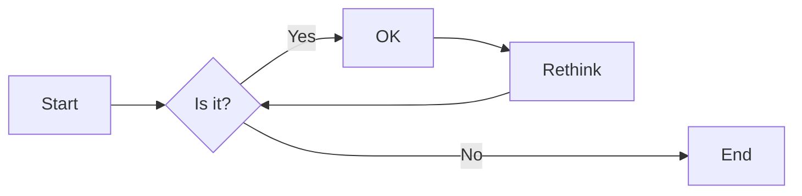
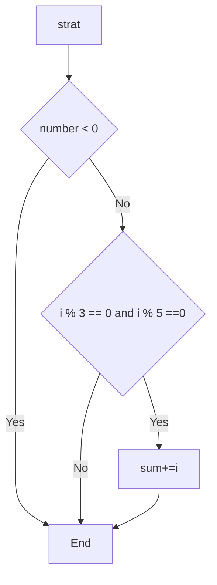
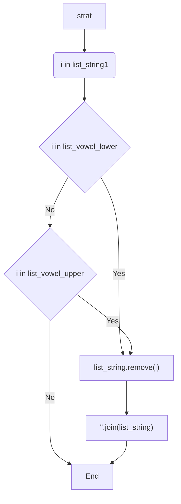

# 实验三 Python列表

班级： 21计科3班

学号： B20210302326

姓名： 李俊瑜

Github地址：<https://gitee.com/Yukilm/python_exp>

CodeWars地址：<https://www.codewars.com/users/Yukilim>

---

## 实验目的

1. 学习Python的简单使用和列表操作
2. 学习Python中的if语句

## 实验环境

1. Git
2. Python 3.10
3. VSCode
4. VSCode插件

## 实验内容和步骤

### 第一部分

Python列表操作

完成教材《Python编程从入门到实践》下列章节的练习：

- 第3章 列表简介
- 第4章 操作列表
- 第5章 if语句

---

### 第二部分

在[Codewars网站](https://www.codewars.com)注册账号，完成下列Kata挑战：

---

#### 第一题：3和5的倍数（Multiples of 3 or 5）

难度： 6kyu

如果我们列出所有低于 10 的 3 或 5 倍数的自然数，我们得到 3、5、6 和 9。这些数的总和为 23. 完成一个函数，使其返回小于某个整数的所有是3 或 5 的倍数的数的总和。此外，如果数字为负数，则返回 0。

注意：如果一个数同时是3和5的倍数，应该只被算一次。

**提示：首先使用列表解析得到一个列表，元素全部是3或者5的倍数。
使用sum函数可以获取这个列表所有元素的和.**

代码提交地址：
<https://www.codewars.com/kata/514b92a657cdc65150000006>

---

#### 第二题： 重复字符的编码器（Duplicate Encoder）

难度： 6kyu

本练习的目的是将一个字符串转换为一个新的字符串，如果新字符串中的每个字符在原字符串中只出现一次，则为"("，如果该字符在原字符串中出现多次，则为")"。在判断一个字符是否是重复的时候，请忽略大写字母。

例如:

```python
"din"      =>  "((("
"recede"   =>  "()()()"
"Success"  =>  ")())())"
"(( @"     =>  "))(("
```

代码提交地址:
<https://www.codewars.com/kata/54b42f9314d9229fd6000d9c>

---

#### 第三题：括号匹配（Valid Braces）

难度：6kyu

写一个函数，接收一串括号，并确定括号的顺序是否有效。如果字符串是有效的，它应该返回True，如果是无效的，它应该返回False。
例如：

```python
"(){}[]" => True 
"([{}])" => True
 "(}" => False
 "[(])" => False 
"[({})](]" => False
```

**提示：
python中没有内置堆栈数据结构，可以直接使用`list`来作为堆栈，其中`append`方法用于入栈，`pop`方法可以出栈。**

代码提交地址
<https://www.codewars.com/kata/5277c8a221e209d3f6000b56>

---

#### 第四题： 从随机三元组中恢复秘密字符串(Recover a secret string from random triplets)

难度： 4kyu

有一个不为你所知的秘密字符串。给出一个随机三个字母的组合的集合，恢复原来的字符串。

这里的三个字母的组合被定义为三个字母的序列，每个字母在给定的字符串中出现在下一个字母之前。"whi "是字符串 "whatisup "的一个三个字母的组合。

作为一种简化，你可以假设没有一个字母在秘密字符串中出现超过一次。

对于给你的三个字母的组合，除了它们是有效的三个字母的组合以及它们包含足够的信息来推导出原始字符串之外，你可以不做任何假设。特别是，这意味着秘密字符串永远不会包含不出现在给你的三个字母的组合中的字母。

测试用例：

```python
secret = "whatisup"
triplets = [
  ['t','u','p'],
  ['w','h','i'],
  ['t','s','u'],
  ['a','t','s'],
  ['h','a','p'],
  ['t','i','s'],
  ['w','h','s']
]
test.assert_equals(recoverSecret(triplets), secret)
```

代码提交地址：
<https://www.codewars.com/kata/53f40dff5f9d31b813000774/train/python>

提示：

- 利用集合去掉`triplets`中的重复字母，得到字母集合`letters`，最后的`secret`应该由集合中的字母组成，`secret`长度也等于该集合。

```python
letters = {letter for triplet in triplets for letter in triplet }
length = len(letters)
```

- 创建函数`check_first_letter(triplets, first_letter)`，检测一个字母是不是secret的首字母，返回True或者False。
- 创建函数`remove_first_letter(triplets, first_letter)`,  从三元组中去掉首字母，返回新的三元组。
- 遍历字母集合letters，利用上面2个函数得到最后的结果`secret`。

---

#### 第五题： 去掉喷子的元音（Disemvowel Trolls）

难度： 7kyu

喷子正在攻击你的评论区!
处理这种情况的一个常见方法是删除喷子评论中的所有元音(字母：a,e,i,o,u)，以消除威胁。
你的任务是写一个函数，接收一个字符串并返回一个去除所有元音的新字符串。
例如，字符串 "This website is for losers LOL!"   将变成 "Ths wbst s fr lsrs LL!".

注意：对于这个Kata来说，y不被认为是元音。
代码提交地址：
<https://www.codewars.com/kata/52fba66badcd10859f00097e>

提示：

- 首先使用列表解析得到一个列表，列表中所有不是元音的字母。
- 使用字符串的join方法连结列表中所有的字母，例如：

```python
last_name = "lovelace"
letters = [letter for letter in last_name ]
print(letters) # ['l', 'o', 'v', 'e', 'l', 'a', 'c', 'e']
name = ''.join(letters) # name = "lovelace"
```

---

### 第三部分

使用Mermaid绘制程序流程图

安装VSCode插件：

- Markdown Preview Mermaid Support
- Mermaid Markdown Syntax Highlighting

使用Markdown语法绘制你的程序绘制程序流程图（至少一个），Markdown代码如下：

[](https://imgse.com/i/pPoKBgf)

显示效果如下：



查看Mermaid流程图语法-->[点击这里](https://mermaid.js.org/syntax/flowchart.html)

使用Markdown编辑器（例如VScode）编写本次实验的实验报告，包括[实验过程与结果](#实验过程与结果)、[实验考查](#实验考查)和[实验总结](#实验总结)，并将其导出为 **PDF格式** 来提交。

## 实验过程与结果

请将实验过程与结果放在这里，包括：

- [第一部分 Python列表操作和if语句](#第一部分)
```python
# 练习 3-1: 姓名 将一些朋友的姓名存储在一个列表中 并将其命名为names 依次访问该列表中的每个元素 从而将每个朋友的姓名都打印出来
names = ['xxx', 'yyy', 'zzz']
for i in names:
    print(i)
```
D:\Study\Python\venv\Scripts\python.exe  <br>
D:\Study\Python\Exercise\exericise-3\exericise-3.1.py  <br>
xxx <br>
yyy <br>
zzz <br>
进程已结束，退出代码为 0

---
```python
# 练习 3-2: 问候语 继续使用练习 3-1中的列表 但不打印每个朋友的姓名 而为每人打印一条消息 每条消息都包含相同的问候语 但抬头为相应朋友的姓名
names = ['xxx', 'yyy', 'zzz']
for i in names:
    print(i + ' ' + 'Hello!')
```
D:\Study\Python\venv\Scripts\python.exe  <br>D:\Study\Python\Exercise\exericise-3\exericise-3.2.py  <br>
xxx Hello!<br>
yyy Hello!<br>
zzz Hello!<br>
进程已结束，退出代码为 0

---
```python
# 练习 3-3: 自己的列表 想想你喜欢的通勤方式 如骑摩托车或开汽车 并创建一个包含多种通勤方式的列表 根据该列表打印一系列有关这些通勤方式的陈述
# 如下所示 I would like to own a Honda motorcycle.
commutes = ['car', 'bike', 'motorcycle']
for i in commutes:
    print('I would like to own a Honda' + ' ' + i)
```
D:\Study\Python\venv\Scripts\python.exe <br>D:\Study\Python\Exercise\exericise-3\exericise-3.3.py <br>
I would like to own a Honda car<br>
I would like to own a Honda bike<br>
I would like to own a Honda motorcycle<br>
进程已结束，退出代码为 0

---
```python
# 练习 3-4: 嘉宾名单 如果你可以邀请任何人一起共进晚餐（无论是在世的还是故去的） 你会邀请哪些人? 请创建一个列表 其中包含至少3个你想邀请的人 然后 使用
# 这个列表打印消息 邀请这些人来与你共进晚餐
dinner = ['uncle', 'aunt', 'brother']
for i in dinner:
    print('I have a dinner with' + ' ' + i)
```
D:\Study\Python\venv\Scripts\python.exe <br>D:\Study\Python\Exercise\exericise-3\exericise-3.4.py <br>
I have a dinner with uncle<br>
I have a dinner with aunt<br>
I have a dinner with brother<br>
进程已结束，退出代码为 0<br>

---
```python
# 练习 3-5: 修改嘉宾名单 你刚得知有位嘉宾无法赴约 因此需要另外邀请一位嘉宾 以完成练习 3-4时编写的程序为基础 在程序末尾添加一条print语句
# 指出哪位嘉宾无法赴约 修改嘉宾名单 将无法赴约的嘉宾的姓名替换为新邀请的嘉宾的姓名 再次打印一系列消息 向名单中的每位嘉宾发出邀请
dinner = ['uncle', 'aunt', 'brother', 'me']
print(f'{dinner[3]} said I cann\'t have a dinner')
dinner[3] = 'sister'
for i in dinner:
    print('I have a dinner with' + ' ' + i)
```
D:\Study\Python\venv\Scripts\python.exe <br>D:\Study\Python\Exercise\exericise-3\exericise-3.5.py <br>
me said I cann't have a dinner<br>
I have a dinner with uncle<br>
I have a dinner with aunt<br>
I have a dinner with brother<br>
I have a dinner with sister<br>
进程已结束，退出代码为 0

---
```python
# 练习 3-6: 添加嘉宾 你刚找到了一个更大的餐桌 可容纳更多的嘉宾 请想想你还想邀请哪三位嘉宾
# 以完成练习 3-4或练习 3-5时编写的程序为基础 在程序末尾添加一条print 语句 指出你找到了一个更大的餐桌
# 使用insert( ) 将一位新嘉宾添加到名单开头
# 使用insert( ) 将另一位新嘉宾添加到名单中间
# 使用append( ) 将最后一位新嘉宾添加到名单末尾
# 打印一系列消息， 向名单中的每位嘉宾发出邀请
dinner = ['uncle', 'aunt', 'brother']
dinner.insert(0,'nephew')
dinner.insert(1,'sister')
dinner.append('couple')
for i in dinner:
    print('I have a dinner with' + ' ' + i)
```
D:\Study\Python\venv\Scripts\python.exe <br>D:\Study\Python\Exercise\exericise-3\exericise-3.6.py <br>
I have a dinner with nephew<br>
I have a dinner with sister<br>
I have a dinner with uncle<br>
I have a dinner with aunt<br>
I have a dinner with brother <br>
I have a dinner with couple <br>
进程已结束，退出代码为 0

---
```python
# 练习 3-7: 缩减名单 你刚得知新购买的餐桌无法及时送达 因此只能邀请两位嘉宾
# 以完成练习 3-6时编写的程序为基础 在程序末尾添加一行代码 打印一条你只能邀请两位嘉宾共进晚餐的消息
# 使用pop() 不断地删除名单中的嘉宾 直到只有两位嘉宾为止 每次从名单中弹出一位嘉宾时 都打印一条消息 让该嘉宾知悉你很抱歉 无法邀请他来共进
# 晚餐
# 对于余下的两位嘉宾中的每一位 都打印一条消息 指出他依然在受邀人之列
# 使用del 将最后两位嘉宾从名单中删除 让名单变成空的 打印该名单 核实程序结束时名单确实是空的
dinner = ['uncle', 'aunt', 'brother']
dinner.insert(0, 'nephew')
dinner.insert(1, 'sister')
dinner.append('couple')
print('Sorry, I only invite two human to have a dinner')
print(dinner)
for i in range(2):
    name = dinner.pop(0)
    print(name + ' ' + 'Sorry')
a = len(dinner)
for i in range(2, a):
    name = dinner.pop()
    print(name + ' ' + 'Sorry')
del dinner[1]
del dinner[0]
print(dinner)
```
D:\Study\Python\venv\Scripts\python.exe <br>D:\Study\Python\Exercise\exericise-3\exericise-3.7.py  <br>
Sorry, I only invite two human to have a dinner <br>
['nephew', 'sister', 'uncle', 'aunt', 'brother', 'couple'] <br>
nephew Sorry <br>
sister Sorry <br>
couple Sorry <br>
brother Sorry <br>
[] <br>
进程已结束，退出代码为 0

---

```python
# 练习 3-8: 放眼世界 想出至少5个你渴望去旅游的地方
# 将这些地方存储在一个列表中 并确保其中的元素不是按字母顺序排列的
# 按原始排列顺序打印该列表 不要考虑输出是否整洁的问题 只管打印原始Python列表
# 使用sorted() 按字母顺序打印这个列表 同时不要修改它
# 再次打印该列表 核实排列顺序未变
# 使用sorted() 按与字母顺序相反的顺序打印这个列表 同时不要修改它
# 再次打印该列表 核实排列顺序未变
# 使用reverse() 修改列表元素的排列顺序 打印该列表 核实排列顺序确实变了
# 使用reverse() 再次修改列表元素的排列顺序 打印该列表 核实已恢复到原来的排列顺序
# 使用sort() 修改该列表 使其元素按字母顺序排列 打印该列表 核实排列顺序确实变了
# 使用sort() 修改该列表 使其元素按与字母顺序相反的顺序排列 打印该列表 核实排列顺序确实变了
places = ['China', 'Japan', 'UK', 'German', 'France']
print(places)
print(sorted(places))
print(sorted(places, reverse=True))
places.sort(reverse=False)
places.reverse()
print(places)
places.reverse()
places.reverse()
print(places)
places.sort()
print(places)
```
D:\Study\Python\venv\Scripts\python.exe  <br>D:\Study\Python\Exercise\exericise-3\exericise-3.8.py <br> 
['China', 'Japan', 'UK', 'German', 'France'] <br>
['China', 'France', 'German', 'Japan', 'UK'] <br>
['UK', 'Japan', 'German', 'France', 'China'] <br>
['UK', 'Japan', 'German', 'France', 'China'] <br>
['UK', 'Japan', 'German', 'France', 'China'] <br>
['China', 'France', 'German', 'Japan', 'UK'] <br>
['UK', 'Japan', 'German', 'France', 'China'] <br>
进程已结束，退出代码为 0

---
```python
# 练习 3-9: 晚餐嘉宾 在完成练习 3-4~练习 3-7时编写的程序之一中 使用len( ) 打印一条消息 指出你邀请了多少位嘉宾来与你共进晚餐
dinner = ['uncle', 'aunt', 'brother']
print(len(dinner))
```
D:\Study\Python\venv\Scripts\python.exe <br>D:\Study\Python\Exercise\exericise-3\exericise-3.9.py <br>
3 <br>
进程已结束，退出代码为 0

---
```python
# 练习 3-10: 尝试使用各个函数 想想可存储到列表中的东西 如山岳 河流 国家 城市 语言或你喜欢的任何东西 编写一个程序 在其中创建一个包含这些元素的列
# 表 然后 对于本章介绍的每个函数 都至少使用一次来处理这个列表
list = ['countries', 'mountains', 'streams', 'cities']
print(len(list))
list.append('Acg')
print(list)
list.insert(0, 'sea')
print(list)
list.pop()
print(list)
list.remove('cities')
print(list)
del list[0]
print(list)
list.sort()
print(list)
print(sorted(list))
list.reverse()
print(list)
```
D:\Study\Python\venv\Scripts\python.exe  <br>D:\Study\Python\Exercise\exericise-3\exericise-3.10.py  <br>
4 <br>
['countries', 'mountains', 'streams', 'cities', 'Acg'] <br>
['sea', 'countries', 'mountains', 'streams', 'cities', 'Acg'] <br>
['sea', 'countries', 'mountains', 'streams', 'cities'] <br>
['sea', 'countries', 'mountains', 'streams']  <br>
['countries', 'mountains', 'streams'] <br>
['countries', 'mountains', 'streams'] <br> 
['countries', 'mountains', 'streams'] <br>
['streams', 'mountains', 'countries'] <br>
进程已结束，退出代码为 0

---
```python
# 练习4-1：比萨 想出至少三种你喜欢的比萨 将其名称存储在一个列表中
# 再使用for循环将每种比萨的名称打印出来
# 修改这个for循环 使其打印包含比萨名称的句子 而不仅仅是比萨的名称 对于每种比萨都显示一行输出 如下所示
# I like pepperoni pizza
# 在程序末尾添加一行代码（不包含for循环中） 指出你有多喜欢比萨。
# 输出应包含针对每种比萨的消息，还有一个总结性句子 如下所示
# I really love pizza
pizza = ['apple', 'banana', 'orange']
for i in pizza:
    print(i)
for i in pizza:
    print(f'I like {i} pizza')
print('I really love pizza!')
```
D:\Study\Python\venv\Scripts\python.exe <br>D:\Study\Python\Exercise\exericise-4\exericise-4.1.py <br>
apple <br>
banana <br>
orange  <br>
I like apple pizza   <br>
I like banana pizza  <br>
I like orange pizza  <br>
I really love pizza! <br>
进程已结束，退出代码为 0

---
```python
# 练习4-2：动物　想出至少三种有共同特征的动物 将其名称存储在一个列表中
# 再使用for循环将每种动物的名称打印出来 如下所示
#  A dog would make a great pet
# 修改这个程序 使其针对每种动物都打印一个句子
# 在程序末尾添加一行代码 指出这些动物的共同之处 如打印下面这样的句子
#  Any of these animals would make a great pet
animals = ['dog', 'wolf', 'cat']
for i in animals:
    print(i)
for i in animals:
    print(f'A {i} would make a great pet')
print('Any of these animals would make a great pet')
```
D:\Study\Python\venv\Scripts\python.exe <br>D:\Study\Python\Exercise\exericise-4\exericise-4.2.py<br> 
dog<br>
wolf <br>
cat <br>
A dog would make a great pet <br>
A wolf would make a great pet <br>
A cat would make a great pet <br>
Any of these animals would make a great pet <br>
进程已结束，退出代码为 0

---
```python
# 练习4-3：数到20　使用一个for循环打印数1～20(含)
for i in range(1, 21):
    print(i, end=' ')
```
D:\Study\Python\venv\Scripts\python.exe  <br>D:\Study\Python\Exercise\exericise-4\exericise-4.3.py  <br>
1 2 3 4 5 6 7 8 9 10 11 12 13 14 15 16 17 18 19 20  <br>
进程已结束，退出代码为 0 <br>

---
```python
# 练习4-4：100万　创建一个包含数1～1 000 000的列表，再使用一个for循环将这些数打印出来。
# 如果输出的时间太长 按Ctrl + C 停止输出 或关闭输出窗口
number = [i for i in range(1, 1_000_001)]
for i in number:
    print(i)
```
进程已结束，退出代码为 0

---
```python
# 练习4-5：一百万求和　创建一个包含数1～1 000 000的列表 再使用min()和max()
# 核实该列表确实是从1开始 到1 000 000结束的 另外，对这个列表调用函数sum()
# 看看Python将一百万个数相加需要多长时间
number = list(range(1, 1_000_001))
print(min(number), max(number), sum(number))
```
D:\Study\Python\venv\Scripts\python.exe <br>D:\Study\Python\Exercise\exericise-4\exericise-4.5.py <br>
1 1000000 500000500000 <br>
进程已结束，退出代码为 0

---
```python
# 练习4-6：奇数　通过给函数range()指定第三个参数来创建一个列表 其中包含1～20的奇数
# 再使用一个for循环将这些数打印出来
numbers = [i for i in range(1, 21, 2)]
for i in numbers:
    print(i, end=' ')
```
D:\Study\Python\venv\Scripts\python.exe <br>D:\Study\Python\Exercise\exericise-4\exericise-4.6.py  <br>
1 3 5 7 9 11 13 15 17 19 <br>
进程已结束，退出代码为 0

---
```python
# 练习4-7：3的倍数　创建一个列表，其中包含3～30能被3整除的数
# 再使用一个for循环将这个列表中的数打印出来
numbers = [i for i in range(3, 30, 3)]
for i in numbers:
    print(i, end=' ')
```
D:\Study\Python\venv\Scripts\python.exe <br>D:\Study\Python\Exercise\exericise-4\exericise-4.7.py  <br>
3 6 9 12 15 18 21 24 27  <br>
进程已结束，退出代码为 0

---
```python
# 练习4-8：立方　将同一个数乘三次称为立方 例如 在Python中，2的立方用2**3表示
# 请创建一个列表 其中包含前10个整数（1～10）的立方 再使用一个for循环将这些立方数打印出来
numbers = [i**3 for i in range(1, 11)]
for i in numbers:
    print(i, end=' ')
```
D:\Study\Python\venv\Scripts\python.exe  <br>D:\Study\Python\Exercise\exericise-4\exericise-4.8.py  <br>
1 8 27 64 125 216 343 512 729 1000  <br>
进程已结束，退出代码为 0

---
```python
# 练习4-9：立方推导式　使用列表推导式生成一个列表，其中包含前10个整数的立方。
for i in [i**3 for i in range(1, 11)]:
    print(i, end=' ')
```
D:\Study\Python\venv\Scripts\python.exe <br>D:\Study\Python\Exercise\exericise-4\exericise-4.9.py <br>
1 8 27 64 125 216 343 512 729 1000  <br>
进程已结束，退出代码为 0

---
```python
# 练习4-10：切片　选择你在本章编写的一个程序 在末尾添加几行代码 以完成如下任务
# 打印消息“The first three items in the list are:” 再使用切片来打印列表的前三个元素
# 打印消息“Three items from the middle of the list are:” 再使用切片来打印列表的中间三个元素
# 打印消息“The last three items in the list are:” 再使用切片来打印列表的末尾三个元素
numbers = [i**3 for i in range(1, 11)]
print(numbers)
print(f'The first three items in the list are: {numbers[:3]}')
print(f'Three items from the middle of the list are: {numbers[(len(numbers)//2 -1):(len(numbers)//2 + 1) + 1]}')
print(f'The last three items in the list are: {numbers[-3:]}')\
```
D:\Study\Python\venv\Scripts\python.exe <br>D:\Study\Python\Exercise\exericise-4\exericise-4.10.py <br> 
[1, 8, 27, 64, 125, 216, 343, 512, 729, 1000] <br>
The first three items in the list are: [1, 8, 27] <br>
Three items from the middle of the list are: [125, 216, 343] <br>
The last three items in the list are: [512, 729, 1000] <br>
进程已结束，退出代码为 0

---
```python
# 练习4-11：你的比萨，我的比萨　在你为完成练习4-1而编写的程序中 创建比萨列表的副本
# 并将其赋给变量friend_pizzas 再完成如下任务
# 在原来的比萨列表中添加一种比萨 在列表friend_pizzas中添加另一种比萨
# 核实有两个不同的列表
# 为此 打印消息“My favorite pizzas are:” 再使用一个for循环来打印第一个列表
# 打印消息“My friend's favorite pizzas are:” 再使用一个for循环来打印第二个列表
# 核实新增的比萨被添加到了正确的列表中
pizza = ['apple', 'banana', 'orange']
friend_pizzas = pizza[:]
pizza.append('cherry')
friend_pizzas.append('lemon')
print('My favorite pizzas are:')
for i in pizza:
    print(i, end=' ')
print('')
print("My friend's favorite pizzas are:")
for i in friend_pizzas:
    print(i, end=' ')
```
D:\Study\Python\venv\Scripts\python.exe <br>D:\Study\Python\Exercise\exericise-4\exericise-4.11.py <br>
My favorite pizzas are: <br>
apple banana orange cherry  <br>
My friend's favorite pizzas are: <br>
apple banana orange lemon <br>
进程已结束，退出代码为 0

---
```python
# 练习4-12：使用多个循环　在本节中 为节省篇幅 程序foods.py的每个版本都没有使用for循环来打印列表
# 请选择一个版本的foods.py 在其中编写两个for循环 将各个食品列表打印出来
my_foods = ['pizza', 'falafel', 'carrot cake']
friend_foods = my_foods[:]
my_foods.append('cannoli')
friend_foods.append('ice cream')
print("My favorite foods are:")
for i in my_foods:
    print(i)
print("\nMy friend's favorite foods are:")
for i in friend_foods:
    print(i)
```
D:\Study\Python\venv\Scripts\python.exe <br>D:\Study\Python\Exercise\exericise-4\exericise-4.12.py <br>
My favorite foods are: <br>
pizza <br>
falafel <br>
carrot cake <br>
cannoli <br>
My friend's favorite foods are: <br>
pizza <br>
falafel <br>
carrot cake <br>
ice cream <br>
进程已结束，退出代码为 0

---
```python
# 练习4-13：自助餐　有一家自助式餐馆，只提供五种简单的食品
# 请想出五种简单的食品 并将其存储在一个元组中
# 使用一个for循环将该餐馆提供的五种食品都打印出来
# 尝试修改其中的一个元素 核实Python确实会拒绝你这样做
# 餐馆调整了菜单 替换了它提供的其中两种食品 请编写一个这样的代码块
# 给元组变量赋值 并使用一个for循环将新元组的每个元素都打印出来
foods = ('rice', 'noodle', 'dumping', 'drinks', 'beef')
for i in foods:
    print(i)
foods = ('chicken', 'cooked_beef', 'dumping', 'drinks', 'beef')
for i in foods:
    print(i)
foods[0] = 'xxx'
```
D:\Study\Python\venv\Scripts\python.exe <br>D:\Study\Python\Exercise\exericise-4\exericise-4.13.py <br>
Traceback (most recent call last):<br>
  File "D:\Study\Python\Exercise\exericise-4\exericise-4.13.py", line 13, in <module><br>
    foods[0] = 'xxx'<br>
    ~~~~~^^^<br>
TypeError: 'tuple' object does not support item assignment<br>
rice<br>
noodle<br>
dumping <br>
drinks <br>
beef <br>
chicken <br>
cooked_beef <br>
dumping <br>
drinks <br>
beef <br>
进程已结束，退出代码为 1

---
练习 4.14: PEP8 请访问Python 官方网站并搜索 "PEP8 - Style Guide for Python Code" 
阅读PEP8格式设置指南 你当前不太能用到它 但是最好先大致浏览一下

---
```python
# 练习 4.15 代码审核 从本章编写的程序中选择三个 根据PEP8对它们进行修改
# 每级缩进都使用4个字符 对你使用的文本编辑器进行设置 使其在你按Tab键时插入4个空格 如果你还没有这样做 现在就去做吧(有关如何设置 请参阅附录B)
# 每行都不要超过80个字符 对你使用的编辑器进行设置 使其在第80个字符处显示一条竖直的参考线
# 不要在程序文件中滥用空行
foods = ('rice', 'noodle', 'dumping', 'drinks', 'beef')
for i in foods:
    print(i)
foods = ('chicken', 'cooked_beef', 'dumping', 'drinks', 'beef')
for i in foods:
    print(i)
my_foods = ['pizza', 'falafel', 'carrot cake']
friend_foods = my_foods[:]
my_foods.append('cannoli')
friend_foods.append('ice cream')
print("My favorite foods are:")
for i in my_foods:
    print(i)
print("\nMy friend's favorite foods are:")
for i in friend_foods:
    print(i)
numbers = [i**3 for i in range(1, 11)]
print(numbers)
print(f'The first three items in the list are: {numbers[:3]}')
print(
    f'Three items from the middle of the list are: {numbers[(len(numbers)//2 -1):(len(numbers)//2 + 1) + 1]}')
print(f'The last three items in the list are: {numbers[-3:]}')
```
D:\Study\Python\venv\Scripts\python.exe <br>D:\Study\Python\Exercise\exericise-4\exericise-4.15.py <br>
rice<br>
noodle<br>
dumping<br>
drinks<br>
beef<br>
chicken<br>
cooked_beef<br>
dumping<br>
drinks<br>
beef<br>
My favorite foods are:<br>
pizza<br>
falafel<br>
carrot cake<br>
cannoli<br>
My friend's favorite foods are:<br>
pizza<br>
falafel<br>
carrot cake<br>
ice cream <br>
[1, 8, 27, 64, 125, 216, 343, 512, 729, 1000] <br>
The first three items in the list are: [1, 8, 27] <br>
Three items from the middle of the list are: [125, 216, 343] <br>
The last three items in the list are: [512, 729, 1000] <br>
进程已结束，退出代码为 0

---
```python
# 练习 5.1：条件测试 编写一系列条件测试 将每个测试以及对其结果的预测和实际结果打印出来 你编写的代码应类似于下面这样
# car = ‘subaru’
# print(“Is car == ‘subaru’? I predict True.”)
# print(car == ‘subaru’)
# print("\nIs car == ‘audi’? I predict False.")
# print(car == ‘audi’)
# 详细研究实际结果 直到你明白它为何为True 或False
# 创建至少10个测试 且其中结果分别为True 和False 的测试都至少有5个
car = 'subaru'
print("Is car == 'subaru'? true")
print(car == 'subaru')
print("Is car == 'honda'? flase")
print(car == 'honda')
print("Is car == 'bwm'? flase")
print(car == 'bwm')
food = 'rice'
print("Is food == 'rice'? true")
print(food == 'rice')
print("Is food == 'beef'? flase")
print(food == 'beef')
happy = 'much_money'
print("Is happy == 'much_money'? true")
print(happy == 'much_money')
print("Is happy == 'little_money'? flase")
print(happy == 'little_money')
work = 'have_money'
print("Is work == 'have_money'?true")
print(work == 'have_money')
print("Is work == 'no_money'?flase")
print(work == 'no_money')
print("Is work == 'big_house'?flase")
print(work == 'big_house')

```
D:\Study\Python\venv\Scripts\python.exe <br>D:\Study\Python\Exercise\exericise-5\exericise-5.1.py <br>
Is car == 'subaru'? true <br>
True<br>
Is car == 'honda'? flase<br>
False<br>
Is car == 'bwm'? flase<br>
False<br>
Is food == 'rice'? true<br>
True<br>
Is food == 'beef'? flase<br>
False<br>
Is happy == 'much_money'? true<br>
True<br>
Is happy == 'little_money'? flase<br>
False<br>
Is work == 'have_money'?true<br>
True<br>
Is work == 'no_money'?flase<br>
False<br>
Is work == 'big_house'?flase<br>
False<br>
进程已结束，退出代码为 0

---
```python
# 练习5.2：更多条件测试 你并非只能创建10个测试 如果想尝试做更多比较 可再编写一些测试 并将它们加入conditional_tests.py中 对于下面列出的各种情况
# 至少编写两个结果分别为True 和False的测试。
# 检查两个字符串相等和不等
# 使用方法lower() 的测试
# 涉及相等、不等、大于、小于、大于等于和小于等于的数值测试
# 使用关键字and 和or 的测试
# 测试特定的值是否包含在列表中
# 测试特定的值是否未包含在列表中
str1 = 'xxx'
str2 = 'yyy'
str3 = 'XXX'
a = 1
b = 2
c = 1
d = 4
numbers = [1, 2, 3]
if str1 == str2:
    print('==')
if str1 != str2:
    print('!=')
if str3.lower() == str1:
    print('==')
if a == c:
    print('==')
if a != b:
    print('!=')
if a > b:
    print('>')
if a < b:
    print('<')
if b >= c:
    print('>=')
if b <= c:
    print('<=')
if a < b and str1 != str2:
    print('True')
if a > b or str1 == str2:
    print('False')
if d not in numbers:
    print('not in')
if a in numbers:
    print('in')
```
D:\Study\Python\venv\Scripts\python.exe <br>D:\Study\Python\Exercise\exericise-5\exericise-5.2.py <br>
!=<br>
==<br>
==<br>
!=<br>
<<br>
>=<br>
True<br>
not in <br>
in <br>
进程已结束，退出代码为 0

---
```python
# 练习5.3：外星人颜色 1 假设在游戏中刚射杀了一个外星人 请创建一个名为alien_color 的变量 并将其赋值为’green’ ‘yellow’ 或’red’
# 写一条if 语句 检查外星人是否是绿色的 如果是 就打印一条消息 指出玩家获得了5分
# 编写这个程序的两个版本 上述条件测试在其中的一个版本中通过 在另一个版本中未通过(未通过条件测试时没有输出)
alien_color = ['green', 'yellow', 'red']
alien = 'green'
if alien == alien_color[0]:
    print('5分')
if alien != alien_color[0]:
    pass
```
D:\Study\Python\venv\Scripts\python.exe <br>D:\Study\Python\Exercise\exericise-5\exericise-5.3.py <br>
5分 <br>
进程已结束，退出代码为 0

---
```python
# 练习5.4：外星人颜色2 像练习5-3那样设置外星人的颜色 并编写一个if-else 结构
# 如果外星人是绿色的 就打印一条消息 指出玩家因射杀该外星人获得了5分
# 如果外星人不是绿色的 就打印一条消息 指出玩家获得了10分
# 编写这个程序的两个版本 在一个版本中执行if 代码块，在另一个版本中执行else 代码块
alien_color = ['green', 'yellow', 'red']
alien = 'green'
if alien == alien_color[0]:
    print('5分')
if alien != alien_color[0]:
    print('10分')

if alien == alien_color[0]:
    print('5分')
else:
    print('10分')
```
D:\Study\Python\venv\Scripts\python.exe <br>D:\Study\Python\Exercise\exericise-5\exericise-5.4.py <br>
5分<br>
5分 <br>
进程已结束，退出代码为 0

---
```python
# 练习 5.5：外星人颜色3 将练习5-4中的if-else 结构改为if-elif-else 结构
# 如果外星人是黄色的 就打印一条消息 指出玩家获得了10分
# 如果外星人是红色的 就打印一条消息 指出玩家获得了15分
# 编写这个程序的三个版本 分别在外星人为绿色 黄色和红色时打印一条消息
alien_color = ['green', 'yellow', 'red']
alien = 'green'
if alien == alien_color[0]:
    print('5分')
elif alien == alien_color[1]:
    print('10分')
elif alien == alien_color[2]:
    print('15分')

if alien == alien_color[0]:
    print('green')
if alien == alien_color[1]:
    print('yellow')
if alien == alien_color[2]:
    print('red')
```
D:\Study\Python\venv\Scripts\python.exe <br>D:\Study\Python\Exercise\exericise-5\exericise-5.5.py <br>
5分 <br>
green <br>
进程已结束，退出代码为 0

---
```python
# 练习 5.6：人生的不同阶段 　
# 设置变量age 的值 再编写一个if-elif-else 结构 根据age 的值判断一个人处于人生的哪个阶段
# 如果年龄小于2岁 就打印一条消息，指出这个人是婴儿
# 如果年龄为2（含）～4岁 就打印一条消息，指出这个人是幼儿
# 如果年龄为4（含）～13岁 就打印一条消息 指出这个人是儿童
# 如果年龄为13（含）～20岁 就打印一条消息 指出这个人是青少年
# 如果年龄为20（含）～65岁 就打印一条消息 指出这个人是成年人
# 如果年龄超过65岁（含） 就打印一条消息 指出这个人是老年人
import random
age = random.randint(1, 65)
print(age)
if age < 2:
    print('婴儿')
elif age < 4:
    print('幼儿')
elif age < 13:
    print('儿童')
elif age < 18:
    print('少年')
elif age < 65:
    print('中青年人')
elif age == 65:
    print('老年人')
```
D:\Study\Python\venv\Scripts\python.exe <br>D:\Study\Python\Exercise\exericise-5\exericise-5.6.py <br>
22 <br>
中青年人 <br>
进程已结束，退出代码为 0

---
```python
# 练习5.7：喜欢的水果 　
# 创建一个列表 其中包含你喜欢的水果 再编写一系列独立的if 语句 检查列表中是否包含特定的水果
# 将该列表命名为favorite_fruits 并在其中包含三种水果
# 编写5条if 语句 每条都检查某种水果是否包含在列表中 如果是 就打印一条像下面这样的消息
# You really like bananas!
favorite_fruits = ['bananas', 'apples', 'cherries']
if 'bananas' in favorite_fruits:
    print('You really like bananas!')
if 'apples' in favorite_fruits:
    print('You really like apples!')
if 'cherries' in favorite_fruits:
    print('You really like cherries!')
if 'lemons' in favorite_fruits:
    print('You really like lemons!')
if 'oranges' in favorite_fruits:
    print('You really like oranges!')
```
D:\Study\Python\venv\Scripts\python.exe <br>D:\Study\Python\Exercise\exericise-5\exericise-5.7.py <br>
You really like bananas!<br>
You really like apples!   <br>
You really like cherries! <br>
进程已结束，退出代码为 0

---
```python
# 练习5.8：以特殊方式跟管理员打招呼 创建一个至少包含5个用户名的列表 且其中一个用户名为’admin’ 想象你要编写代码
# 在每位用户登录网站后都打印一条问候消息
# 遍历用户名列表 并向每位用户打印一条问候消息
# 如果用户名为’admin’ 就打印一条特殊的问候消息 如下所示
# Hello admin, would you like to see a status report?
# 否则 打印一条普通的问候消息 如下所示
# Hello Jaden, thank you for logging in again.
usernames = ['admin', 'Sakura', 'Yuki', 'Toma', 'Rolaids']
for i in usernames:
    if i == 'admin':
        print(f'Hello {i}, would you like to see a status report?')
    else:
        print(f'Hello {i}, thank you for logging in again.')
```
D:\Study\Python\venv\Scripts\python.exe <br>D:\Study\Python\Exercise\exericise-5\exericise-5.8.py <br>
Hello admin, would you like to see a status report?<br>
Hello Sakura, thank you for logging in again.<br>
Hello Yuki, thank you for logging in again.<br>
Hello Toma, thank you for logging in again.<br>
Hello Rolaids, thank you for logging in again.<br>
进程已结束，退出代码为 0

---
```python
# 练习5.9：处理没有用户的情形 在为完成练习5-8编写的程序中 添加一条if 语句 检查用户名列表是否为空
# 如果为空 就打印如下消息
# We need to find some users!
# 输出列表中的所有用户名 确认将打印正确的消息
usernames = ['admin', 'Sakura', 'Yuki', 'Toma', 'Rolaids']
print(usernames)
for i in range(len(usernames)):
    usernames.pop()
if not usernames:
    print('We need to find some users!')
```
D:\Study\Python\venv\Scripts\python.exe <br>D:\Study\Python\Exercise\exericise-5\exericise-5.9.py <br>
['admin', 'Sakura', 'Yuki', 'Toma', 'Rolaids']<br>
We need to find some users! <br>
进程已结束，退出代码为 0

---
```python
# 练习5.10：检查用户名 按下面的说明编写一个程序 模拟网站如何确保每位用户的用户名都独一无二
# 创建一个至少包含5个用户名的列表 并将其命名为current_users
# 再创建一个包含5个用户名的列表 将其命名为new_users 并确保其中有一两个用户名也包含在列表current_users 中
# 遍历列表new_users ，对于其中的每个用户名，都检查它是否已被使用
# 如果是 就打印一条消息 指出需要输入别的用户名 否则 打印一条消息 指出这个用户名未被使用
# 确保比较时不区分大小写 换句话说 如果用户名’John’ 已被使用，应拒绝用户名’JOHN’
# (为此 需要创建列表current_users 的副本 其中包含当前所有用户名的小写版本)
usernames = ['admin', 'Sakura', 'Yuki', 'Toma', 'Rolaids']
username = ['Yuki', 'Sakura', 'Lifer', 'Serial', 'Gabriel']
usernames1 = []
for i in usernames:
    usernames1.append(i.lower())
usernames2 = []
for i in username:
    usernames2.append(i.lower())
count = 0
for i in usernames1:
    if i in usernames2:
        print(f'该用户名已被使用:{usernames[count]}')
    count += 1
```
D:\Study\Python\venv\Scripts\python.exe <br>D:\Study\Python\Exercise\exericise-5\exericise-5.10.py <br>
该用户名已被使用:Sakura<br>
该用户名已被使用:Yuki<br>
进程已结束，退出代码为 0


---
```python
# 练习5.11：序数 序数表示顺序位置 如1st和2nd 序数大多以th结尾 只有1、2和3例外
# 在一个列表中存储数字1～9
# 遍历这个列表
# 在循环中使用一个if-elif-else 结构 以打印每个数字对应的序数 输出内容应为
# "1st 2nd 3rd 4th 3rd 4th 5th 6th 7th 8th 9th", 每个序数都独占一行
numbers = [1, 2, 3, 4, 5, 6, 7, 8, 9]
for i in numbers:
    if i == 1:
        print('1st')
    elif i == 2:
        print('2nd')
    elif i == 3:
        print('3rd')
    else:
        print(f'{i}th')
```
D:\Study\Python\venv\Scripts\python.exe <br>D:\Study\Python\Exercise\exericise-5\exericise-5.11.py <br>
1st<br>
2nd<br>
3rd<br>
4th<br>
5th<br>
6th<br>
7th<br>
8th<br>
9th <br>
进程已结束，退出代码为 0

---
```python
# 练习 5.12: 设置if语句的格式 审核你在本章编写的程序 确保正确地设置了条件测试的格式
```

---
```python
# 练习 5.13: 自己的想法 与刚拿起本书时相比 现在你是一名能力更强的程序员了 鉴于你对如何在程序中模拟现实情况有了更深入的认识
# 可以考虑使用程序来解决一些问题了 随着编程技能不断提高 你可能想解决一些问题 请将这方面的想法记录下来
# 想想你可能想编写的游戏 想研究的数据集 以及想创建的Web应用程序
print('Gal-game')
```

---

- [第二部分 Codewars Kata挑战](#第二部分)

---

---

#### 第一题：3和5的倍数（Multiples of 3 or 5）

难度： 6kyu

如果我们列出所有低于 10 的 3 或 5 倍数的自然数，我们得到 3、5、6 和 9。这些数的总和为 23. 完成一个函数，使其返回小于某个整数的所有是3 或 5 的倍数的数的总和。此外，如果数字为负数，则返回 0。

注意：如果一个数同时是3和5的倍数，应该只被算一次。

```python
def solution(number):
    if number < 0:
        return 0

    numbers = []
    for i in range(number):
        if i % 3 == 0 or i % 5 == 0:
            numbers.append(i)

    sum = 0
    for i in numbers:
        sum += i

    return sum
```
Test Results:
Fixed tests <br>
Should return 3 for n=4<br>
Should return 8 for n=6<br>
Should return 60 for n=16<br>
Should return 0 for n=3<br>
Should return 3 for n=5<br>
Should return 45 for n=15<br>
Should return 0 for n=0<br>
Should return 0 for n=-1<br>
Should return 23 for n=10<br>
Should return 78 for n=20<br>
Should return 9168 for n=200<br>
Completed in 0.73ms<br>
Random tests<br>
Random tests<br>
 (35 of 35 Assertions)<br>
Completed in 4.34ms<br>
You have passed all of the tests! :)

---

#### 第二题： 重复字符的编码器（Duplicate Encoder）

难度： 6kyu

本练习的目的是将一个字符串转换为一个新的字符串，如果新字符串中的每个字符在原字符串中只出现一次，则为"("，如果该字符在原字符串中出现多次，则为")"。在判断一个字符是否是重复的时候，请忽略大写字母。

例如:

```python
"din"      =>  "((("
"recede"   =>  "()()()"
"Success"  =>  ")())())"
"(( @"     =>  "))(("
```

```python
def duplicate_encode(word):
    words = ''
    for i in word:
        words += i.title()

    list_word = list(words)
    numbers = []

    for i in range(0, len(list_word)):
        for j in range(i + 1, len(list_word)):
            if list_word[i] == list_word[j]:
                numbers.append(i)
                numbers.append(j)

    for i in range(len(list_word)):
        if i in numbers:
            list_word[i] = ')'
        else:
            list_word[i] = '('

    return ''.join(list_word)
```
Test Results: <br>
Duplicate Encoder <br>
Basic Test Cases <br>
 (6 of 6 Assertions) <br>
Tests with '(' and ')' <br>
 (2 of 2 Assertions) <br>
And now... some random tests !<br>
 (40 of 40 Assertions)<br>
Completed in 7.72ms<br>
You have passed all of the tests! :)
---

#### 第三题：括号匹配（Valid Braces）

难度：6kyu

写一个函数，接收一串括号，并确定括号的顺序是否有效。如果字符串是有效的，它应该返回True，如果是无效的，它应该返回False。
例如：

```python
"(){}[]" => True 
"([{}])" => True
 "(}" => False
 "[(])" => False 
"[({})](]" => False
```

```python
def valid_braces(string):
    list_braces = []
    for i in string:
        if i in '({[':
            list_braces.append(i)
        elif len(list_braces) != 0:
            if i == ')' and list_braces[-1] == '(':
                list_braces.pop()
            elif (i == '}') and (list_braces[-1] == '{'):
                list_braces.pop()
            elif list_braces[-1] == '[':
                list_braces.pop()
    if len(list_braces) == 0:
        return True
    else:
        return False
```
Test Results: <br>
Valid Braces<br>
sample Tests<br>
 (13 of 13 Assertions)<br>
Completed in 0.21ms<br>
You have passed all of the tests! :)<br>

---

#### 第四题： 从随机三元组中恢复秘密字符串(Recover a secret string from random triplets)

难度： 4kyu

有一个不为你所知的秘密字符串。给出一个随机三个字母的组合的集合，恢复原来的字符串。

这里的三个字母的组合被定义为三个字母的序列，每个字母在给定的字符串中出现在下一个字母之前。"whi "是字符串 "whatisup "的一个三个字母的组合。

作为一种简化，你可以假设没有一个字母在秘密字符串中出现超过一次。

对于给你的三个字母的组合，除了它们是有效的三个字母的组合以及它们包含足够的信息来推导出原始字符串之外，你可以不做任何假设。特别是，这意味着秘密字符串永远不会包含不出现在给你的三个字母的组合中的字母。


```python
secret = "whatisup"
triplets = [
  ['t','u','p'],
  ['w','h','i'],
  ['t','s','u'],
  ['a','t','s'],
  ['h','a','p'],
  ['t','i','s'],
  ['w','h','s']
]
test.assert_equals(recoverSecret(triplets), secret)
```
```python
def check_first_letter(triplets, first_letter):
    """检测一个字母是不是secret的首字母，返回True或者False。"""
    count = 0
    for triplet in triplets:
        for letter in triplet:
            if first_letter == letter:
                if triplet.index(letter) != 0:
                    count = 1
    if count == 0:
        return True
    else:
        return False


def remove_first_letter(triplets, first_letter):
    """从三元组中去掉首字母，返回新的三元组。"""
    for triplet in triplets:
        for i in triplet:
            if i == first_letter:
                triplet.remove(i)
                triplet.insert(2, '0')

    return triplets


def recoverSecret(triplets):
    letters = [letter for triplet in triplets for letter in triplet]
    string = ''
    new_letters = []
    new_letter = []

    for i in letters:
        if i not in new_letters:
            new_letters.append(i)

    while len(string) < len(new_letters):
        for i in range(len(new_letters)):
            if new_letters[i] not in new_letter:
                result = check_first_letter(triplets, new_letters[i])
                if result:
                    new_letter.append(new_letters[i])
                    triplets = remove_first_letter(triplets, new_letters[i])
                    string += new_letters[i]
        
    return string
```
Test Results:<br>
Test Passed<br>
Test Passed<br>
Test Passed<br>
Test Passed<br>
Test Passed<br>
You have passed all of the tests! :)

---

#### 第五题： 去掉喷子的元音（Disemvowel Trolls）

难度： 7kyu

喷子正在攻击你的评论区!
处理这种情况的一个常见方法是删除喷子评论中的所有元音(字母：a,e,i,o,u)，以消除威胁。
你的任务是写一个函数，接收一个字符串并返回一个去除所有元音的新字符串。
例如，字符串 "This website is for losers LOL!"   将变成 "Ths wbst s fr lsrs LL!".

```python
def disemvowel(string_):
    list_vowel_lower = ['a', 'e', 'i', 'o', "u"]
    list_vowel_upper = ['A', 'E', 'I', 'O', 'U']
    list_string = list(i for i in string_)
    list_string1 = list_string[:]
    for i in list_string1:
        if i in list_vowel_lower:
            list_string.remove(i)
        if i in list_vowel_upper:
            list_string.remove(i)

    return ''.join(list_string)
```
Test Results: <br>
Fixed Tests <br>
First fixed test <br>
Second fixed test <br>
Third fixed test <br>
Random Tests<br>
 (100 of 100 Assertions)<br>
Completed in 13.24ms<br>
You have passed all of the tests! :)

---

- [第三部分 使用Mermaid绘制程序流程图](#第三部分)
---
第二部分 第一题

flowchart TD<br>
    A[strat] --> B{number < 0}<br>
    B --> |Yes| C[End]<br>
    B --> |No| D{i % 3 == 0 and i % 5 ==0}<br>
    D --> |Yes| E[sum+=i]<br>
    D --> |No| C<br>
    E --> C<br>


---
第二部分 第五题

flowchart TD<br>
    A[strat] --> B(i in list_string1)<br>
    B --> C{i in list_vowel_lower}<br>
    C --> |No| D{i in list_vowel_upper}<br>
    C --> |Yes| E["list_string.remove(i)"]<br>
    D --> |Yes| E["list_string.remove(i)"]<br>
    D --> |No| F[End]<br>
    E --> G["''.join(list_string)"]<br>
    G--> F<br>




## 实验考查

请使用自己的语言并使用尽量简短代码示例回答下面的问题，这些问题将在实验检查时用于提问和答辩以及实际的操作。

1. Python中的列表可以进行哪些操作？
创建 遍历 切片 增删改查 排序 反转

2. 哪两种方法可以用来对Python的列表排序？这两种方法有和区别？
sort() 与 sorted() sorted是临时的

3. 如何将Python列表逆序打印？
list.reverse()
print(list)

4. Python中的列表执行哪些操作时效率比较高？哪些操作效率比较差？是否有类似的数据结构可以用来替代列表？
访问元素 添加和删除末尾元素 是效率高的
插入和删除元素 查找元素 是效率差的
可以使用元组来代替列表

5. 阅读《Fluent Python》Chapter 2. An Array of Sequence - Tuples Are Not Just Immutable Lists小节（p30-p35）。总结该小节的主要内容。
<br>
元组是不可变的序列：元组是一种不可变的序列，一旦创建就不能修改。元组可以包含任意类型的对象，并且可以嵌套其他元组。<br>
元组的创建和访问：可以使用逗号分隔的值来创建元组，也可以使用tuple()函数将其他可迭代对象转换为元组。可以通过索引访问元组中的元素，也可以使用切片来获取子元组。<br>
元组拆包：可以将元组的元素拆包到多个变量中，这样可以方便地同时获取多个值。<br>
元组作为记录：元组可以用来表示记录，其中每个元素都有特定的含义。可以通过索引或拆包来访问记录中的字段。<br>
元组作为不可变列表的替代：元组可以用来表示不可变的列表，因为元组的不可变性可以提供更好的安全性和性能。<br>
元组的不可变性：元组的不可变性是指元组的元素不能修改，但是如果元组的元素是可变对象，那么可变对象的状态是可以修改的。<br>

## 实验总结

学会了Python的基本列表使用 也了解了列表的基本操作 如增删改查 切片等 也学会了Python中的if条件测试和for循环语句 知道了if-else if-elif-else的使用与用途 也知道了列表推导式这个简便赋值
