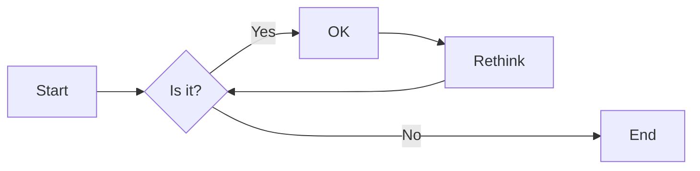
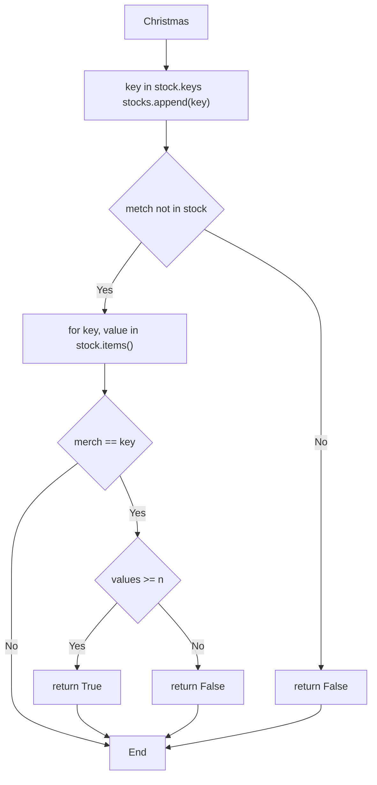

# 实验四 Python字典和while循环

班级： 21计科3班

学号： B20210302326

姓名： 李俊瑜

Github地址：<https://github.com/Yukilm/python_exp>

CodeWars地址：<https://www.codewars.com/users/Yukilim>

---

## 实验目的

1. 学习Python字典
2. 学习Python用户输入和while循环

## 实验环境

1. Git
2. Python 3.10
3. VSCode
4. VSCode插件

## 实验内容和步骤

### 第一部分

Python列表操作

完成教材《Python编程从入门到实践》下列章节的练习：

- 第6章 字典
- 第7章 用户输入和while循环

---

### 第二部分

在[Codewars网站](https://www.codewars.com)注册账号，完成下列Kata挑战：

---

#### 第一题：淘气还是乖孩子（Naughty or Nice）

难度： 7kyu

圣诞老人要来镇上了，他需要你帮助找出谁是淘气的或善良的。你将会得到一整年的JSON数据，按照这个格式：

```python
{
    January: {
        '1': 'Naughty','2': 'Naughty', ..., '31': 'Nice'
    },
    February: {
        '1': 'Nice','2': 'Naughty', ..., '28': 'Nice'
    },
    ...
    December: {
        '1': 'Nice','2': 'Nice', ..., '31': 'Naughty'
    }
}
```

你的函数应该返回 "Naughty!"或 "Nice!"，这取决于在某一年发生的总次数（以较大者为准）。如果两者相等，则返回 "Nice！"。
代码提交地址：
<https://www.codewars.com/kata/5662b14e0a1fb8320a00005c>

---

#### 第二题： 观察到的PIN（The observed PIN）

难度：4kyu

好了，侦探，我们的一个同事成功地观察到了我们的目标人物，抢劫犯罗比。我们跟踪他到了一个秘密仓库，我们认为在那里可以找到所有被盗的东西。这个仓库的门被一个电子密码锁所保护。不幸的是，我们的间谍不确定他看到的密码，当罗比进入它时。

键盘的布局如下：

```python
┌───┬───┬───┐
│ 1 │ 2 │ 3 │
├───┼───┼───┤
│ 4 │ 5 │ 6 │
├───┼───┼───┤
│ 7 │ 8 │ 9 │
└───┼───┼───┘
    │ 0 │
    └───┘
```

他注意到密码1357，但他也说，他看到的每个数字都有可能是另一个相邻的数字（水平或垂直，但不是对角线）。例如，代替1的也可能是2或4。而不是5，也可能是2、4、6或8。

他还提到，他知道这种锁。你可以无限制地输入错误的密码，但它们最终不会锁定系统或发出警报。这就是为什么我们可以尝试所有可能的（*）变化。

*可能的意义是：观察到的PIN码本身和考虑到相邻数字的所有变化。

你能帮助我们找到所有这些变化吗？如果有一个函数，能够返回一个列表，其中包含一个长度为1到8位的观察到的PIN的所有变化，那就更好了。我们可以把这个函数命名为getPINs（在python中为get_pins，在C#中为GetPINs）。

但请注意，所有的PINs，包括观察到的PINs和结果，都必须是字符串，因为有可能会有领先的 "0"。我们已经为你准备了一些测试案例。
侦探，我们就靠你了!
代码提交地址：
<https://www.codewars.com/kata/5263c6999e0f40dee200059d>

---

#### 第三题： RNA到蛋白质序列的翻译（RNA to Protein Sequence Translation）

难度：6kyu

蛋白质是由DNA转录成RNA，然后转译成蛋白质的中心法则。RNA和DNA一样，是由糖骨架（在这种情况下是核糖）连接在一起的长链核酸。每个由三个碱基组成的片段被称为密码子。称为核糖体的分子机器将RNA密码子转译成氨基酸链，称为多肽链，然后将其折叠成蛋白质。

蛋白质序列可以像DNA和RNA一样很容易地可视化，作为大字符串。重要的是要注意，“停止”密码子不编码特定的氨基酸。它们的唯一功能是停止蛋白质的转译，因此它们不会被纳入多肽链中。“停止”密码子不应出现在最终的蛋白质序列中。为了节省您许多不必要（和乏味）的键入，已为您的氨基酸字典提供了键和值。

给定一个RNA字符串，创建一个将RNA转译为蛋白质序列的函数。注意：测试用例将始终生成有效的字符串。

```python
protein（'UGCGAUGAAUGGGCUCGCUCC'）
```

将返回`CDEWARS`

作为测试用例的一部分是一个真实世界的例子！最后一个示例测试用例对应着一种叫做绿色荧光蛋白的蛋白质，一旦被剪切到另一个生物体的基因组中，像GFP这样的蛋白质可以让生物学家可视化细胞过程！

Amino Acid Dictionary

```python
   # Your dictionary is provided as PROTEIN_DICT
   PROTEIN_DICT = {
    # Phenylalanine
    'UUC': 'F', 'UUU': 'F',
    # Leucine
    'UUA': 'L', 'UUG': 'L', 'CUU': 'L', 'CUC': 'L', 'CUA': 'L', 'CUG': 'L',
    # Isoleucine
    'AUU': 'I', 'AUC': 'I', 'AUA': 'I',
    # Methionine
    'AUG': 'M',
    # Valine
    'GUU': 'V', 'GUC': 'V', 'GUA': 'V', 'GUG': 'V',
    # Serine
    'UCU': 'S', 'UCC': 'S', 'UCA': 'S', 'UCG': 'S', 'AGU': 'S', 'AGC': 'S',
    # Proline
    'CCU': 'P', 'CCC': 'P', 'CCA': 'P', 'CCG': 'P',
    # Threonine
    'ACU': 'T', 'ACC': 'T', 'ACA': 'T', 'ACG': 'T',
    # Alanine
    'GCU': 'A', 'GCC': 'A', 'GCA': 'A', 'GCG': 'A',
    # Tyrosine
    'UAU': 'Y', 'UAC': 'Y',
    # Histidine
    'CAU': 'H', 'CAC': 'H',
    # Glutamine
    'CAA': 'Q', 'CAG': 'Q',
    # Asparagine
    'AAU': 'N', 'AAC': 'N',
    # Lysine
    'AAA': 'K', 'AAG': 'K',
    # Aspartic Acid
    'GAU': 'D', 'GAC': 'D',
    # Glutamic Acid
    'GAA': 'E', 'GAG': 'E',
    # Cystine
    'UGU': 'C', 'UGC': 'C',
    # Tryptophan
    'UGG': 'W',
    # Arginine
    'CGU': 'R', 'CGC': 'R', 'CGA': 'R', 'CGG': 'R', 'AGA': 'R', 'AGG': 'R',
    # Glycine
    'GGU': 'G', 'GGC': 'G', 'GGA': 'G', 'GGG': 'G',
    # Stop codon
    'UAA': 'Stop', 'UGA': 'Stop', 'UAG': 'Stop'
}
```

代码提交地址：
<https://www.codewars.com/kata/555a03f259e2d1788c000077>

---

#### 第四题： 填写订单（Thinkful - Dictionary drills: Order filler）

难度：8kyu

您正在经营一家在线业务，您的一天中很大一部分时间都在处理订单。随着您的销量增加，这项工作占用了更多的时间，不幸的是最近您遇到了一个情况，您接受了一个订单，但无法履行。

您决定写一个名为`fillable()`的函数，它接受三个参数：一个表示您库存的字典`stock`，一个表示客户想要购买的商品的字符串`merch`，以及一个表示他们想购买的商品数量的整数n。如果您有足够的商品库存来完成销售，则函数应返回`True`，否则应返回`False`。

有效的数据将始终被传入，并且n将始终大于等于1。

代码提交地址：
<https://www.codewars.com/kata/586ee462d0982081bf001f07/python>

---

#### 第五题： 莫尔斯码解码器（Decode the Morse code, advanced）

难度： 4kyu

在这个作业中，你需要为有线电报编写一个莫尔斯码解码器。
有线电报通过一个有按键的双线路运行，当按下按键时，会连接线路，可以在远程站点上检测到。莫尔斯码将每个字符的传输编码为"点"（按下按键的短按）和"划"（按下按键的长按）的序列。

在传输莫尔斯码时，国际标准规定：

- "点" - 1个时间单位长。
- "划" - 3个时间单位长。
- 字符内点和划之间的暂停 - 1个时间单位长。
- 单词内字符之间的暂停 - 3个时间单位长。
- 单词间的暂停 - 7个时间单位长。

但是，该标准没有规定"时间单位"有多长。实际上，不同的操作员会以不同的速度进行传输。一个业余人士可能需要几秒钟才能传输一个字符，一位熟练的专业人士可以每分钟传输60个单词，而机器人发射器可能会快得多。

在这个作业中，我们假设消息的接收是由硬件自动执行的，硬件会定期检查线路，如果线路连接（远程站点的按键按下），则记录为1，如果线路未连接（远程按键弹起），则记录为0。消息完全接收后，它会以一个只包含0和1的字符串的形式传递给你进行解码。

例如，消息`HEYJUDE`，即`·····−·−−··−−−··−−··`可以如下接收：

```python
1100110011001100000011000000111111001100111111001111110000000000000011001111110011111100111111000000110011001111110000001111110011001100000011
```

如您所见，根据标准，这个传输完全准确，硬件每个"点"采样了两次。

因此，你的任务是实现两个函数：

函数decodeBits(bits)，应该找出消息的传输速率，正确解码消息为点（.）、划（-）和空格（字符之间有一个空格，单词之间有三个空格），并将它们作为一个字符串返回。请注意，在消息的开头和结尾可能会出现一些额外的0，确保忽略它们。另外，如果你无法分辨特定的1序列是点还是划，请假设它是一个点。

函数decodeMorse(morseCode)，它将接收上一个函数的输出，并返回一个可读的字符串。

注意：出于编码目的，你必须使用ASCII字符.和-，而不是Unicode字符。

莫尔斯码表已经预加载给你了（请查看解决方案设置，以获取在你的语言中使用它的标识符）。

```python
morseCodes(".--")  #to access the morse translation of ".--"
```

下面是Morse码支持的完整字符列表：

```javascript
A    ·–
B    –···
C    –·–·
D    –··
E    ·
F    ··–·
G    ––·
H    ····
I    ··
J    ·–––
K    –·–
L    ·–··
M    ––
N    –·
O    –––
P    ·––·
Q    ––·–
R    ·–·
S    ···
T    –
U    ··–
V    ···–
W    ·––
X    –··–
Y    –·––
Z    ––··
0    –––––
1    ·––––
2    ··–––
3    ···––
4    ····–
5    ·····
6    –····
7    ––···
8    –––··
9    ––––·
.    ·–·–·–
,    ––··––
?    ··––··
'    ·––––·
!    –·–·––
/    –··–·
(    –·––·
)    –·––·–
&    ·–···
:    –––···
;    –·–·–·
=    –···–
+    ·–·–·
-    –····–
_    ··––·–
"    ·–··–·
$    ···–··–
@    ·––·–·
```

代码提交地址：
<https://www.codewars.com/kata/decode-the-morse-code-advanced>

---

### 第三部分

使用Mermaid绘制程序流程图

安装VSCode插件：

- Markdown Preview Mermaid Support
- Mermaid Markdown Syntax Highlighting

使用Markdown语法绘制你的程序绘制程序流程图（至少一个），Markdown代码如下：

[](https://imgse.com/i/pPoKBgf)

显示效果如下：



查看Mermaid流程图语法-->[点击这里](https://mermaid.js.org/syntax/flowchart.html)

使用Markdown编辑器（例如VScode）编写本次实验的实验报告，包括[实验过程与结果](#实验过程与结果)、[实验考查](#实验考查)和[实验总结](#实验总结)，并将其导出为 **PDF格式** 来提交。

## 实验过程与结果

请将实验过程与结果放在这里，包括：

- [第一部分 Python列表操作和if语句](#第一部分)
```python
# 练习 6.1: 人 使用一个字典来存储一个人的信息，
# 包括名 姓 年龄和居住的城市 该字典应包含键first_name last_name age 和city 将存储在该字典中的每项信息都打印出来
human = {
    'first_name':  'Yuki',
    'last_name': 'Sakura',
    'age': 16,
    'city': 'Acg'
}

print(human)
```
D:\Study\Python\venv\Scripts\python.exe <br>D:\Study\Python\Exercise\exericise-6\exericise-6.1.py <br>
{'first_name': 'Yuki', 'last_name': 'Sakura', 'age': 16, 'city': 'Acg'} <br>
进程已结束，退出代码为 0

---
```python
# 练习 6-2: 喜欢的数字1 使用一个字典来存储一些人喜欢的数字 请想出5个人的名字 并将这些名字用作字典中的键 想出每个人喜欢的一个数字
# 并将这些数字作为值存储在字典中 打印每个人的名字和喜欢的数字 为让这个程序更有趣 通过询问朋友确保数据是真实的
human = {
    'Yuki': 16,
    'Sakura': 18,
    'Tundra': 20,
    'Guda': 22,
    'Macros': 24
}
for key,value in human.items():
    print(f'{key}喜欢的数据是{value}?')
```
D:\Study\Python\venv\Scripts\python.exe <br>D:\Study\Python\Exercise\exericise-6\exericise-6.2.py <br>
Yuki喜欢的数据是16?<br>
Sakura喜欢的数据是18?<br>
Tundra喜欢的数据是20?<br>
Guda喜欢的数据是22?<br>
Macros喜欢的数据是24? <br>
进程已结束，退出代码为 0

---
```python
# 练习 6.3: 词汇表1 Python字典可用于模拟现实生活中的字典 但为避免混淆 我们将后者称为词汇表
# 想出你在前面学过的5个编程词汇 将它们用作词汇表中的键 并将它们的含义作为值存储在词汇表
# 以整洁的方式打印每个词汇及其含义 为此 你可以先打印词汇 在它后面加上一个冒号 再打印词汇的含义 也可在一行打印词汇 再使用换行符(\n)插入一个空行
# 然后在下一行以缩进的方式打印词汇的含义
programming = {
    'str': '字符串化',
    'len': '长度',
    'int': '整数化',
    'list': '列表化',
    'set': '集合化',
}

for k,v in programming.items():
    print(f'{k}: {v}')
```
D:\Study\Python\venv\Scripts\python.exe <br>D:\Study\Python\Exercise\exericise-6\exericise-6.3.py <br>
str: 字符串化<br>
len: 长度<br>
int: 整数化<br>
list: 列表化<br>
set: 集合化 <br>
进程已结束，退出代码为 0

---
```python
# 练习 6.4 词汇表2 ：既然你知道了如何遍历字典 现在请整理你为完成练习6-3而编写的代码
# 将其中的一系列print 语句替换为一个遍历字典中的键和值的循环。
# 确定该循环正确无误后 再在词汇表中添加5个Python术语 当你再次运行这个程序时
# 这些新术语及其含义将自动包含在输出中
programming = {
    'str': '字符串化',
    'len': '长度',
    'int': '整数化',
    'list': '列表化',
    'set': '集合化',
}

for k,v in programming.items():
    print(f'{k}: {v}')

print()

programming['tuple'] = '元组化'
programming['print'] = '打印'
programming['if'] = '条件判断'
programming['for'] = '循环1'
programming['while'] = '循环2'

for k,v in programming.items():
    print(f'{k}: {v}')
```
D:\Study\Python\venv\Scripts\python.exeD:\Study\Python\Exercise\exericise-6\exericise-6.4.py
str: 字符串化
len: 长度
int: 整数化
list: 列表化
set: 集合化

str: 字符串化
len: 长度
int: 整数化
list: 列表化<br>
set: 集合化<br>
tuple: 元组化<br>
print: 打印 <br>
if: 条件判断 <br>
for: 循环1 <br>
while: 循环2 <br>
进程已结束，退出代码为 0


---
```python
# 练习 6.5: 河流 创建一个字典，在其中存储三条大河流及其流经的国家
# 其中一个键—值对可能是'nile': 'egypt'
# 使用循环为每条河流打印一条消息 如“The Nile runs through Egypt.”
# 使用循环将该字典中每条河流的名字都打印出来

rivers = {
    'nile': 'Egypt',
    'huang': 'China',
    'chang': 'China',
    'river': 'country',
    'stream': 'countryside'
}

for river, country in rivers.items():
    print('The', river, 'runs through', country)

for river in rivers.keys():
    print(river)

for country in rivers.values():
    print(country)
```
D:\Study\Python\venv\Scripts\python.exe <br>D:\Study\Python\Exercise\exericise-6\exericise-6.5.py <br>
The nile runs through Egypt<br>
The huang runs through China<br>
The chang runs through China<br>
The river runs through country<br>
The stream runs through countryside<br>
nile<br>
huang<br>
chang<br>
river<br>
stream<br>
Egypt<br>
China<br>
China<br>
country<br>
countryside <br>
进程已结束，退出代码为 0

---
```python
# 练习 6.6 调查：在6.3.1节编写的程序favorite_languages.py中执行以下操作
# 创建一个应该会接受调查的人员名单 其中有些人已包含在字典中 而其他人未包含在字典中
# 遍历这个人员名单 对于已参与调查的人，打印一条消息表示感谢
# 对于还未参与调查的人 打印一条消息邀请他参与调查
favorite_languages = {
    'jen': 'python',
    'sarah': 'c',
    'edward': 'ruby',
    'phil': 'python',
}

people = ['jen', 'phil', '白起', '铠', 'sarah']
for p in people:
    if p in favorite_languages.keys():
        print(p, '谢谢参与调查！')
    else:
        print(p, '您还未参与调查，请点击下方链接参与调查！')
```
D:\Study\Python\venv\Scripts\python.exe <br>D:\Study\Python\Exercise\exericise-6\exericise-6.6.py <br>
jen 谢谢参与调查！<br>
phil 谢谢参与调查！<br>
白起 您还未参与调查，请点击下方链接参与调查！<br>
铠 您还未参与调查，请点击下方链接参与调查！<br>
sarah 谢谢参与调查！<br>
进程已结束，退出代码为 0


---
```python
# 练习6.7：人们 　
# 在为完成练习6-1而编写的程序中 再创建两个表示人的字典
# 然后将这三个字典都存储在一个名为people 的列表中 遍历这个列表 将其中每个人的所有信息都打印出来
human1 = {
    'first_name': 'Yuki',
    'last_name': 'Sakura',
    'age': 16,
    'city': 'Acg'
}
human2 = {
    'first_name': 'march',
    'last_name': 'zhang',
    'age': 21,
    'city': 'nanjing'
}
human3 = {
    'first_name': 'alice',
    'last_name': 'yang',
    'age': 31,
    'city': 'xinjiang'
}
people = [human1, human2, human3]

for i in people:
    print(i)
```
D:\Study\Python\venv\Scripts\python.exe <br>D:\Study\Python\Exercise\exericise-6\exericise-6.7.py <br>
{'first_name': 'Yuki', 'last_name': 'Sakura', 'age': 16, 'city': 'Acg'}<br>
{'first_name': 'march', 'last_name': 'zhang', 'age': 21, 'city': 'nanjing'}<br>
{'first_name': 'alice', 'last_name': 'yang', 'age': 31, 'city': 'xinjiang'} <br>
进程已结束，退出代码为 0

---
```python
# 练习 6.8：宠物 　
# 创建多个表示宠物的字典 每个字典都包含宠物的类型及其主人的名字
# 将这些字典存储在一个名为pets 的列表中 再遍历该列表 并将有关每个宠物的所有信息都打印出来
pet0 = {
    'type': 'cat',
    'own_name': 'may'
}
pet1 = {
    'type': 'dog',
    'own_name': 'march'
}
pet2 = {
    'type': 'pig',
    'own_name': 'helen'
}

pets = [pet0, pet1, pet2]
for pet in pets:
    print(pet)
```
D:\Study\Python\venv\Scripts\python.exe <br>D:\Study\Python\Exercise\exericise-6\exericise-6.8.py <br>
{'type': 'cat', 'own_name': 'may'}<br>
{'type': 'dog', 'own_name': 'march'}<br>
{'type': 'pig', 'own_name': 'helen'} <br>
进程已结束，退出代码为 0

---
```python
# 练习 6.10：喜欢的数2　
# 修改为完成练习6-2而编写的程序 让每个人都可以有多个喜欢的数 然后将每个人的名字及其喜欢的数打印出来
favorite_places = {
    'Yuki': ['1', '2', '3'],
    'Sakura': ['7', '8'],
    'Tundra': ['20'],
    'Guda': ['6', '5'],
    'Macros': ['4', '9']
}
for k,v in favorite_places.items():
    print(f"{k.title()} favorite number are:")
    for place in v:
        print(f"{place}")
```
D:\Study\Python\venv\Scripts\python.exe <br>D:\Study\Python\Exercise\exericise-6\exericise-6.9.py <br>
Yuki favorite number are:<br>
1<br>
2<br>
3<br>
Sakura favorite number are:<br>
7<br>
8<br>
Tundra favorite number are:<br>
20<br>
Guda favorite number are:<br>
6<br>
5<br>
Macros favorite number are:<br>
4<br>
9 <br>
进程已结束，退出代码为 0

---
```python
# 练习6.9：喜欢的地方 　
# 创建一个名为favorite_places 的字典 在这个字典中 将三个人的名字用作键 并存储每个人喜欢的1～3个地方
# 为了让这个练习更有趣些 可以让一些朋友说出他们喜欢的几个地方 遍历这个字典 并将其中每个人的名字及其喜欢的地方打印出来
favorite_places = {'Sakura':['shanghai','HongKong'],
                   'Yuki':['beijing'],
                   'Toma':['newYork','wuhan','xian'],
                   }
for k,v in favorite_places.items():
    print(f"{k.title()} favorite places are : ")
    for place in v:
        print(f"{place.title()}")
```
D:\Study\Python\venv\Scripts\python.exe <br>D:\Study\Python\Exercise\exericise-6\exericise-6.10.py <br>
Sakura favorite places are : <br>
Shanghai<br>
Hongkong<br>
Yuki favorite places are : <br>
Beijing<br>
Toma favorite places are : <br>
Newyork<br>
Wuhan<br>
Xian<br>
进程已结束，退出代码为 0

---
```python
# 练习 6.11：城市 　
# 创建一个名为人口约数以及一个有关该城市的事实 在表示每座城市的字典中 应包含country population 和fact 等键
# 将每座城市的名字以及有关信息都打印出来
cities = {
    'wuhan': {
        'country': 'china',
        'population': 10000000,
        'fact': 'many university',
    },
    'beijing': {
        'country': 'china',
        'population': 20000000,
        'fact': 'culture centre',
    },
    'newYork': {
        'country': 'usa',
        'population': 100000,
        'fact': 'many money',
    },
}
for k, v in cities.items():
    print(f"CITY:{k.title()}")
    country = v['country']
    print(f"COUNTRY:{country.title()}")
    population = v['population']
    print(f"POPULATION:{population}")
    fact = v['fact']
    print(f"FACT:{fact.title()}")
```
D:\Study\Python\venv\Scripts\python.exe <br>D:\Study\Python\Exercise\exericise-6\exericise-6.11.py <br>
CITY:Wuhan<br>
COUNTRY:China<br>
POPULATION:10000000<br>
FACT:Many University<br>
CITY:Beijing<br>
COUNTRY:China<br>
POPULATION:20000000<br>
FACT:Culture Centre<br>
CITY:Newyork<br>
COUNTRY:Usa<br>
POPULATION:100000<br>
FACT:Many Money<br>
进程已结束，退出代码为 0

---
```python
# 练习 6.12 扩展
# 本章的示例足够复杂 能以很多方式进行扩展 请对本章的一个示例进行扩展: 添加键和值 调整程序要解决的问题 或改进输出的格式
human = {
    'first_name':  'Yuki',
    'last_name': 'Sakura',
    'age': 16,
    'city': 'Acg'
}

for k,v in human.items():
    print(f'{k}:{v}')
```
D:\Study\Python\venv\Scripts\python.exe <br>D:\Study\Python\Exercise\exericise-6\exericise-6.12.py <br>
first_name:Yuki<br>
last_name:Sakura<br>
age:16<br>
city:Acg<br>
进程已结束，退出代码为 0

---
```python
# 练习 7.1: 汽车租赁
# 编写一个程序 询问用户要租赁什么样的汽车 并打印一条消息 如“Let me see if I can find you a Subaru”
car=input("What are you wan to bus:")
print(f"Let me see if I can find you a {car}")

```
D:\Study\Python\venv\Scripts\python.exe D:\Study\Python\Exercise\exericise-7\exericise-7.1.py <br>
What are you wan to bus:1<br>
Let me see if I can find you a 1 <br>
进程已结束，退出代码为 0

---
```python
# 练习7.2: 餐馆订位
# 编写一个程序 询问用户有多少人用餐 如果超过8人 就打印一条消息 指出没有空桌 否则指出有空桌
people = int(input("How many you are want to invite people:"))
if people > 8:
    print("没有空座")
else:
    print("有空座")
```
D:\Study\Python\venv\Scripts\python.exe D:\Study\Python\Exercise\exericise-7\exericise-7.2.py <br>
How many you are want to invite people:01<br>
有空座<br>
进程已结束，退出代码为 0

---
```python
# 练习 7.3: 10的整数倍
# 让用户输入一个数字 并指出这个数字是否是10的整数倍
number = int(input("输入一个数字："))
if number % 10 == 0:
    print(f"{number} 是10的整数倍")
else:
    print(f"{number} 不是10的整数倍")
```
D:\Study\Python\venv\Scripts\python.exe D:\Study\Python\Exercise\exericise-7\exericise-7.3.py <br>
输入一个数字：10<br>
10 是10的整数倍<br>
进程已结束，退出代码为 0

---
```python
# 练习 7.4: 比萨配料
# 编写一个循环 提示用户输入一系列的比萨配料 并在用户输入’quit’ 时结束循环
# 每当用户输入一种配料后 都打印一条消息 说我们会在比萨中添加这种配料
pisa = " "
while pisa != 'quit':
    pisa = input("输入一种披萨配料：")
    if pisa != 'quit':
        print(f"我们会在披萨中添加 {pisa} 配料")
```
D:\Study\Python\venv\Scripts\python.exe D:\Study\Python\Exercise\exericise-7\exericise-7.4.py <br>
输入一种披萨配料：1<br>
我们会在披萨中添加 1 配料<br>
输入一种披萨配料：quit<br>
进程已结束，退出代码为 0

---
```python
# 练习 7.5: 电影票 有家电影院根据观众的年龄收取不同的票价
# 不到3岁的观众免费 3~12岁的观众为10美元 超过12岁的观众为15美元
# 请编写一个循环 在其中询问用户的年龄 并指出其票价
age = " "
while age != -1:
    age = int(input("输入观众年龄："))
    if age > 12:
        print("15")
    elif age > 3:
        print("10")
    elif 3 >= age > 0:
        print("0")
    else:
        break
```
D:\Study\Python\venv\Scripts\python.exe D:\Study\Python\Exercise\exericise-7\exericise-7.5.py <br>
输入观众年龄：1<br>
0<br>
输入观众年龄：9<br>
10<br>
输入观众年龄：-1<br>
进程已结束，退出代码为 0

---
```python
# 练习 7.6: 三个出口 以另一种方式完成练习7-4或练习7-5 在程序中采取如下所有做法
# 在while 循环中使用条件测试来结束循环
# 使用变量active 来控制循环结束的时机
# 使用break 语句在用户输入’quit’时退出循环
active = True
while active:
    age = int(input("输入观众年龄："))
    if age > 12:
        print("15")
    elif age > 3:
        print("10")
    elif 3 >= age > 0:
        print("0")
    else:
        active = False
```
D:\Study\Python\venv\Scripts\python.exe D:\Study\Python\Exercise\exericise-7\exericise-7.6.py <br>
输入观众年龄：15<br>
15<br>
输入观众年龄：-1<br>
进程已结束，退出代码为 0

---
```python
# 练习 7.7: 无限循环 编写一个没完没了的循环 并运行它(要结束该循环 可按Ctrl +C 也可关闭显示输出的窗口)
while True:
    print(1)
```

---
```python
# 练习 7.8: 熟食店 创建一个名为sandwich_orders 的列表 在其中包含各种三明治的名字 再创建一个名为finished_sandwiches 的空列表
# 遍历列表sandwich_orders 对于其中的每种三明治 都打印一条消息 如I made your tuna sandwich 将其移到列表finished_sandwiches
# 所有三明治都制作好后 打印一条消息 将这些三明治列出来
sandwich_orders = ['a', 'b', 'c']
finished_sandwiches = []
while sandwich_orders:
    sandwich = sandwich_orders.pop()
    print(f"I made your {sandwich} sandwich")
    finished_sandwiches.append(sandwich)
for a in finished_sandwiches:
    print(a)
```
D:\Study\Python\venv\Scripts\python.exe D:\Study\Python\Exercise\exericise-7\exericise-7.8.py <br>
I made your c sandwich<br>
I made your b sandwich<br>
I made your a sandwich<br>
c<br>
b<br>
a<br>
进程已结束，退出代码为 0

---
```python
# 练习 7.9: 五香烟熏牛肉卖完了
# 使用为完成练习7-8而创建的列表sandwich_orders 并确保’pastrami’ 在其中至少出现了三次
# 在程序开头附近添加这样的代码 打印一条消息 指出熟食店的五香烟熏牛肉卖完了
# 再使用一个while 循环将列表sandwich_orders 中的’pastrami’ 都删除  确认最终的列表finished_sandwiches 中不包含’pastrami’
sandwich_orders = ['pastrami', 'a', 'pastrami', 'b', 'c', 'pastrami']
finished_sandwiches = []
print('pastrami' + "卖完了")
while 'pastrami' in sandwich_orders:
    sandwich_orders.remove('pastrami')
while sandwich_orders:
    sandwich = sandwich_orders.pop()
    print(f"I made your {sandwich} sandwich")
    finished_sandwiches.append(sandwich)
for a in finished_sandwiches:
    print(a)
```
D:\Study\Python\venv\Scripts\python.exe D:\Study\Python\Exercise\exericise-7\exericise-7.9.py <br>
pastrami卖完了<br>
I made your c sandwichv
I made your b sandwich<br>
I made your a sandwich<br>
c<br>
b<br>
a<br>
进程已结束，退出代码为 0

---
```python
# 练习 7.10: 梦想的度假胜地 编写一个程序 调查用户梦想的度假胜地
# 使用类似于“If you could visit one place in the world, where would you go?”的提示 并编写一个打印调查结果的代码块
travel = {}
ends = 'yes'
while ends != 'no':
    location = input("请输入想去的地方：")
    people = input("带哪个朋友：")
    travel[location] = people
    ends = input("是否继续\'yes or no\'")
for m, n in travel.items():
    print(f"输入想去的地方：{m} 带哪个朋友：{n}")
```
D:\Study\Python\venv\Scripts\python.exe D:\Study\Python\Exercise\exericise-7\exericise-7.10.py <br>
请输入想去的地方：1<br>
带哪个朋友：2<br>
是否继续'yes or no'no<br>
输入想去的地方：1 带哪个朋友：2<br>
进程已结束，退出代码为 0

---

- [第二部分 Codewars Kata挑战](#第二部分)


---

#### 第一题：淘气还是乖孩子（Naughty or Nice）

难度： 7kyu

圣诞老人要来镇上了，他需要你帮助找出谁是淘气的或善良的。你将会得到一整年的JSON数据，按照这个格式：

```python
{
    January: {
        '1': 'Naughty','2': 'Naughty', ..., '31': 'Nice'
    },
    February: {
        '1': 'Nice','2': 'Naughty', ..., '28': 'Nice'
    },
    ...
    December: {
        '1': 'Nice','2': 'Nice', ..., '31': 'Naughty'
    }
}
```
你的函数应该返回 "Naughty!"或 "Nice!"，这取决于在某一年发生的总次数（以较大者为准）。如果两者相等，则返回 "Nice！"

```python
def naughty_or_nice(data):
    count1 = 0
    count2 = 0
    for months,values in data.items():
        for nn in values.values():
            if nn == 'Nice':
                count1 += 1
            elif nn == 'Naughty':
                count2 += 1

    if count1 >= count2:
        return 'Nice!'
    else:
        return 'Naughty!'
```
You have passed all of the tests! :)

---

#### 第二题： 观察到的PIN（The observed PIN）

难度：4kyu

好了，侦探，我们的一个同事成功地观察到了我们的目标人物，抢劫犯罗比。我们跟踪他到了一个秘密仓库，我们认为在那里可以找到所有被盗的东西。这个仓库的门被一个电子密码锁所保护。不幸的是，我们的间谍不确定他看到的密码，当罗比进入它时。

键盘的布局如下：

```python
┌───┬───┬───┐
│ 1 │ 2 │ 3 │
├───┼───┼───┤
│ 4 │ 5 │ 6 │
├───┼───┼───┤
│ 7 │ 8 │ 9 │
└───┼───┼───┘
    │ 0 │
    └───┘
```

他注意到密码1357，但他也说，他看到的每个数字都有可能是另一个相邻的数字（水平或垂直，但不是对角线）。例如，代替1的也可能是2或4。而不是5，也可能是2、4、6或8。

他还提到，他知道这种锁。你可以无限制地输入错误的密码，但它们最终不会锁定系统或发出警报。这就是为什么我们可以尝试所有可能的（*）变化。

*可能的意义是：观察到的PIN码本身和考虑到相邻数字的所有变化。

你能帮助我们找到所有这些变化吗？如果有一个函数，能够返回一个列表，其中包含一个长度为1到8位的观察到的PIN的所有变化，那就更好了。我们可以把这个函数命名为getPINs（在python中为get_pins，在C#中为GetPINs）。

但请注意，所有的PINs，包括观察到的PINs和结果，都必须是字符串，因为有可能会有领先的 "0"。我们已经为你准备了一些测试案例。 侦探，我们就靠你了!

```python
import itertools
def get_pins(observed):
    numbers_1 = []
    new_numbers = []
    for i in observed:
        numbers_1.append(numbers[i])

    result_num = list(itertools.product(*numbers_1))
    for n in result_num:
        for m in n:
            new_numbers.append(str(m))
    r_num = "".join(new_numbers)
    result = [r_num[i:i + len(observed)] for i in range(0, len(r_num), len(observed))]
    return result

numbers = {'1': [1, 2, 4],
           '2': [1, 2, 3, 5],
           '3': [2, 3, 6],
           '4': [1, 4, 5, 7],
           '5': [2, 4, 5, 6, 8],
           '6': [3, 5, 6, 9],
           '7': [4, 7, 8],
           '8': [5, 7, 8, 9, 0],
           '9': [6, 8, 9],
           '0': [8, 0]
           }
```

You have passed all of the tests! :)

---

#### 第三题： RNA到蛋白质序列的翻译（RNA to Protein Sequence Translation）

难度：6kyu

蛋白质是由DNA转录成RNA，然后转译成蛋白质的中心法则。RNA和DNA一样，是由糖骨架（在这种情况下是核糖）连接在一起的长链核酸。每个由三个碱基组成的片段被称为密码子。称为核糖体的分子机器将RNA密码子转译成氨基酸链，称为多肽链，然后将其折叠成蛋白质。

蛋白质序列可以像DNA和RNA一样很容易地可视化，作为大字符串。重要的是要注意，“停止”密码子不编码特定的氨基酸。它们的唯一功能是停止蛋白质的转译，因此它们不会被纳入多肽链中。“停止”密码子不应出现在最终的蛋白质序列中。为了节省您许多不必要（和乏味）的键入，已为您的氨基酸字典提供了键和值。

```python
def protein(rna):
def protein(rna):
    string = []
    new_string = ''
    stop = True
    for i in range(0, len(rna), 3):
        string.append(rna[i:i + 3])

    for i in string:
        for key,value in PROTEIN_DICT.items():
            if stop:
                if i == key:
                    if value == 'Stop':
                        stop = False
                    else:
                        new_string += value

    return new_string
```
You have passed all of the tests! :)

---

#### 第四题： 填写订单（Thinkful - Dictionary drills: Order filler）

难度：8kyu

您正在经营一家在线业务，您的一天中很大一部分时间都在处理订单。随着您的销量增加，这项工作占用了更多的时间，不幸的是最近您遇到了一个情况，您接受了一个订单，但无法履行。

您决定写一个名为`fillable()`的函数，它接受三个参数：一个表示您库存的字典`stock`，一个表示客户想要购买的商品的字符串`merch`，以及一个表示他们想购买的商品数量的整数n。如果您有足够的商品库存来完成销售，则函数应返回`True`，否则应返回`False`。

有效的数据将始终被传入，并且n将始终大于等于1。

```python
def fillable(stock, merch, n):
    stocks = []
    for key in stock.keys():
        stocks.append(key)
    if merch not in stock:
        return False
    else:
        for key, value in stock.items():
            if merch == key:
                if value >= n:
                    return True
                else:
                    return False
```
You have passed all of the tests! :)

---

#### 第五题： 莫尔斯码解码器（Decode the Morse code, advanced）

难度： 4kyu

在这个作业中，你需要为有线电报编写一个莫尔斯码解码器。
有线电报通过一个有按键的双线路运行，当按下按键时，会连接线路，可以在远程站点上检测到。莫尔斯码将每个字符的传输编码为"点"（按下按键的短按）和"划"（按下按键的长按）的序列。

在传输莫尔斯码时，国际标准规定：

- "点" - 1个时间单位长。
- "划" - 3个时间单位长。
- 字符内点和划之间的暂停 - 1个时间单位长。
- 单词内字符之间的暂停 - 3个时间单位长。
- 单词间的暂停 - 7个时间单位长。

但是，该标准没有规定"时间单位"有多长。实际上，不同的操作员会以不同的速度进行传输。一个业余人士可能需要几秒钟才能传输一个字符，一位熟练的专业人士可以每分钟传输60个单词，而机器人发射器可能会快得多。

在这个作业中，我们假设消息的接收是由硬件自动执行的，硬件会定期检查线路，如果线路连接（远程站点的按键按下），则记录为1，如果线路未连接（远程按键弹起），则记录为0。消息完全接收后，它会以一个只包含0和1的字符串的形式传递给你进行解码。

因此，你的任务是实现两个函数：

函数decodeBits(bits)，应该找出消息的传输速率，正确解码消息为点（.）、划（-）和空格（字符之间有一个空格，单词之间有三个空格），并将它们作为一个字符串返回。请注意，在消息的开头和结尾可能会出现一些额外的0，确保忽略它们。另外，如果你无法分辨特定的1序列是点还是划，请假设它是一个点。

函数decodeMorse(morseCode)，它将接收上一个函数的输出，并返回一个可读的字符串。

```pythoon
def decode_bits(bits):
    bits = bits.strip("0")
    unit = 0
    for bit in bits:
        if bit != "0":
            unit += 1
        else:
            break
            
    morse_code = ""

    words = bits.split("0" * 7 * unit)
    for word in words:
        characters = word.split("0" * 3 * unit)
        for character in characters:
            signs = character.split("0" * unit)
            for sign in signs:
                if sign == "1" * 3 * unit:
                    morse_code += "–"
                else:
                    morse_code += "·"
            morse_code += " "
        morse_code += "   "
    return morse_code


def decode_morse(morse_code):
    morse_code.strip()
    result = ""
    characters = morse_code.split(" ")
    for character in characters:
        if character != "":
            result += morse_codes[character]
        else:
            result += " "
    return ' '.join(result.split())


morse_codes = {
    '·–': 'A',
    '–···': 'B',
    '–·–·': 'C',
    '–··': 'D',
    '·': 'E',
    '··–·': 'F',
    '––·': 'G',
    '····': 'H',
    '··': 'I',
    '·–––': 'J',
    '–·–': 'K',
    '·–··': 'L',
    '––': 'M',
    '–·': 'N',
    '–––': 'O',
    '·––·': 'P',
    '––·–': 'Q',
    '·–·': 'R',
    '···': 'S',
    '–': 'T',
    '··–': 'U',
    '···–': 'V',
    '·––': 'W',
    '–··–': 'X',
    '–·––': 'Y',
    '––··': 'Z',
    '–––––': '0',
    '·––––': '1',
    '··–––': '2',
    '···––': '3',
    '····–': '4',
    '·····': '5',
    '–····': '6',
    '––···': '7',
    '–––··': '8',
    '––––·': '9',
    '·–·–·–': '.',
    '––··––': ',',
    '··––··': '?',
    '–·–·––': '!',
    '–··–·': '/',
    '–·––·': '(',
    '–·––·–': ')',
    '·–···': '&',
    '–––···': ':',
    '–·–·–·': ';',
    '–···–': '=',
    '·–·–·': '+',
    '–····–': '-',
    '··––·–': '_',
    '·–··–·': '"',
    '···–··–': '$',
    '·––·–·': '@',
    '·––––·': "'"
}
```
You have passed all of the tests! :)

---


- [第三部分 使用Mermaid绘制程序流程图](#第三部分)
第二部分 第四题

flowchart TD
    A[Christmas] --> B["key in stock.keys  stocks.append(key)"]  <br>
    B --> C{metch not in stock}<br>
    C --> |Yes| D["for key, value in stock.items()"]<br>
    C --> |No| E[return False]<br>
    D --> F{merch == key}<br>
    F --> |No| G[End]<br>
    E --> G<br>
    F --> |Yes| H{values >= n}<br>
    H --> |Yes| I[return True]<br>
    H --> |No| J[return False]<br>
    I --> G<br>
    J --> G<br>




## 实验考查

请使用自己的语言并使用尽量简短代码示例回答下面的问题，这些问题将在实验检查时用于提问和答辩以及实际的操作。

1. 字典的键和值有什么区别？<br>
字典的键用于唯一标识和访问值 而值是与键相关联的对象 键必须是不可变的 而值可以是任意类型的对象
2. 在读取和写入字典时，需要使用默认值可以使用什么方法？ <br>
使用get()方法和setdefault()方法 可以在读取和写入字典时设置默认值
3. Python中的while循环和for循环有什么区别？<br>
while循环适用于不确定循环次数的情况 根据条件动态控制循环的执行
for循环适用于已知循环次数的情况 遍历可迭代对象中的所有元素
4. 阅读[PEP 636 – Structural Pattern Matching: Tutorial](https://peps.python.org/pep-0636/), 总结Python 3.10中新出现的match语句的使用方法。<br>
基本语法：
match expression: <br>
    pattern1:<br>
        # code block 1<br>
    pattern2:<br>
        # code block 2<br>
    ...<br>
    patternN:<br>
        # code block N<br>
模式（pattern）：<br>
模式是用于匹配表达式的结构或值的规则。<br>
可以使用常量、变量、通配符、类型注解等作为模式。<br>
可以使用|操作符将多个模式组合在一起，表示匹配任意一个模式。<br>
可以使用_作为通配符，表示匹配任意值。<br>
匹配顺序：<br>
match语句会按照从上到下的顺序依次匹配模式，一旦匹配成功，就执行对应的代码块，并跳出match语句。<br>
如果没有匹配成功的模式，会抛出MatchError异常。<br>
变量绑定：<br>
在模式中可以使用变量，并将匹配成功的值绑定到变量上。<br>
绑定的变量可以在对应的代码块中使用。<br>
类型注解：<br>
可以在模式中使用类型注解，用于限定匹配的类型。<br>
类型注解可以是具体的类型，也可以是类型变量。<br>
守卫（guard）：<br>
可以在模式后面使用if关键字加上一个条件表达式，用于进一步过滤匹配的结果。<br>
只有当条件表达式为True时，才会执行对应的代码块。<br>
嵌套match语句：<br>
可以在代码块中嵌套使用match语句，实现更复杂的模式匹配逻辑。<br>
可以根据模式匹配来执行不同的代码块。它提供了一种简洁、灵活的方式来处理多个条件分支，使代码更易读、维护<br>
## 实验总结

学会了字典的基本语法与使用 也学会了input语句的使用 while循环和while循环与if循环的适用场景 还有match语句的作用
