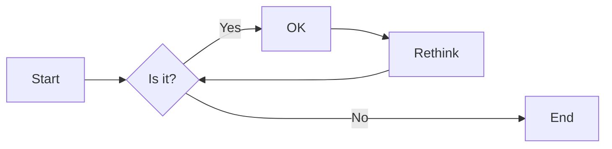
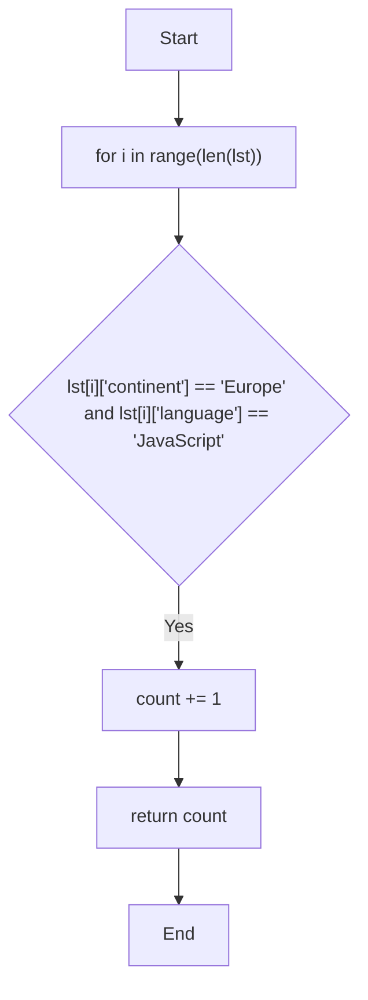

# 实验六 Python函数

班级： 21计科3班

学号： B20210302326

姓名： 李俊瑜

Github地址：<https://github.com/Yukilm/python_exp>

CodeWars地址：<https://www.codewars.com/users/Yukilim>

---

## 实验目的

1. 学习Python函数的基本用法
2. 学习lambda函数和高阶函数的使用
3. 掌握函数式编程的概念和实践

## 实验环境

1. Git
2. Python 3.10
3. VSCode
4. VSCode插件

## 实验内容和步骤

### 第一部分

Python函数

完成教材《Python编程从入门到实践》下列章节的练习：

- 第8章 函数

---

### 第二部分

在[Codewars网站](https://www.codewars.com)注册账号，完成下列Kata挑战：

---

#### 第一题：编码聚会1

难度： 7kyu

你将得到一个字典数组，代表关于首次报名参加你所组织的编码聚会的开发者的数据。
你的任务是返回来自欧洲的JavaScript开发者的数量。
例如，给定以下列表：

```python
lst1 = [
  { 'firstName': 'Noah', 'lastName': 'M.', 'country': 'Switzerland', 'continent': 'Europe', 'age': 19, 'language': 'JavaScript' },
  { 'firstName': 'Maia', 'lastName': 'S.', 'country': 'Tahiti', 'continent': 'Oceania', 'age': 28, 'language': 'JavaScript' },
  { 'firstName': 'Shufen', 'lastName': 'L.', 'country': 'Taiwan', 'continent': 'Asia', 'age': 35, 'language': 'HTML' },
  { 'firstName': 'Sumayah', 'lastName': 'M.', 'country': 'Tajikistan', 'continent': 'Asia', 'age': 30, 'language': 'CSS' }
]
```

你的函数应该返回数字1。
如果，没有来自欧洲的JavaScript开发人员，那么你的函数应该返回0。

注意：
字符串的格式将总是"Europe"和"JavaScript"。
所有的数据将始终是有效的和统一的，如上面的例子。

这个卡塔是Coding Meetup系列的一部分，其中包括一些简短易行的卡塔，这些卡塔是为了让人们掌握高阶函数的使用。在Python中，这些方法包括：`filter`, `map`, `reduce`。当然也可以采用其他方法来解决这些卡塔。

[代码提交地址](https://www.codewars.com/kata/coding-meetup-number-1-higher-order-functions-series-count-the-number-of-javascript-developers-coming-from-europe)

---

#### 第二题： 使用函数进行计算

难度：5kyu

这次我们想用函数来写计算，并得到结果。让我们看一下一些例子：

```python
seven(times(five())) # must return 35
four(plus(nine())) # must return 13
eight(minus(three())) # must return 5
six(divided_by(two())) # must return 3
```

要求：

- 从0（"零"）到9（"九"）的每个数字都必须有一个函数。
- 必须有一个函数用于以下数学运算：加、减、乘、除。
- 每个计算都由一个操作和两个数字组成。
- 最外面的函数代表左边的操作数，最里面的函数代表右边的操作数。
- 除法应该是整数除法。

例如，下面的计算应该返回2，而不是2.666666...。

```python
eight(divided_by(three()))
```

代码提交地址：
<https://www.codewars.com/kata/525f3eda17c7cd9f9e000b39>

---

#### 第三题： 缩短数值的过滤器(Number Shortening Filter)

难度：6kyu

在这个kata中，我们将创建一个函数，它返回另一个缩短长数字的函数。给定一个初始值数组替换给定基数的 X 次方。如果返回函数的输入不是数字字符串，则应将输入本身作为字符串返回。

例子：

```python
filter1 = shorten_number(['','k','m'],1000)
filter1('234324') == '234k'
filter1('98234324') == '98m'
filter1([1,2,3]) == '[1,2,3]'
filter2 = shorten_number(['B','KB','MB','GB'],1024)
filter2('32') == '32B'
filter2('2100') == '2KB';
filter2('pippi') == 'pippi'
```

代码提交地址：
<https://www.codewars.com/kata/56b4af8ac6167012ec00006f>

---

#### 第四题： 编码聚会7

难度： 6kyu

您将获得一个对象序列，表示已注册参加您组织的下一个编程聚会的开发人员的数据。

您的任务是返回一个序列，其中包括最年长的开发人员。如果有多个开发人员年龄相同，则将他们按照在原始输入数组中出现的顺序列出。

例如，给定以下输入数组：
```python
list1 = [
  { 'firstName': 'Gabriel', 'lastName': 'X.', 'country': 'Monaco', 'continent': 'Europe', 'age': 49, 'language': 'PHP' },
  { 'firstName': 'Odval', 'lastName': 'F.', 'country': 'Mongolia', 'continent': 'Asia', 'age': 38, 'language': 'Python' },
  { 'firstName': 'Emilija', 'lastName': 'S.', 'country': 'Lithuania', 'continent': 'Europe', 'age': 19, 'language': 'Python' },
  { 'firstName': 'Sou', 'lastName': 'B.', 'country': 'Japan', 'continent': 'Asia', 'age': 49, 'language': 'PHP' },
]
```

您的程序应该返回如下结果：

```python
[
  { 'firstName': 'Gabriel', 'lastName': 'X.', 'country': 'Monaco', 'continent': 'Europe', 'age': 49, 'language': 'PHP' },
  { 'firstName': 'Sou', 'lastName': 'B.', 'country': 'Japan', 'continent': 'Asia', 'age': 49, 'language': 'PHP' },
]
```

注意：

- 输入的列表永远都包含像示例中一样有效的正确格式的数据，而且永远不会为空。

代码提交地址：
<https://www.codewars.com/kata/582887f7d04efdaae3000090>

---

#### 第五题： Currying versus partial application

难度： 4kyu

[Currying versus partial application](https://2ality.com/2011/09/currying-vs-part-eval.html)是将一个函数转换为具有更小arity(参数更少)的另一个函数的两种方法。虽然它们经常被混淆，但它们的工作方式是不同的。目标是学会区分它们。

Currying

是一种将接受多个参数的函数转换为以每个参数都只接受一个参数的一系列函数链的技术。

Currying接受一个函数：

```python
f：X × Y → R
```

并将其转换为一个函数：

```python
f'：X → (Y → R)
```

我们不再使用两个参数调用f，而是使用第一个参数调用f'。结果是一个函数，然后我们使用第二个参数调用该函数来产生结果。因此，如果非curried f被调用为：

```python
f(3, 5)
```

那么curried f'被调用为：

```python
f'(3)(5)
```

示例
给定以下函数：

```python
def add(x, y, z):
  return x + y + z
```

我们可以以普通方式调用：

```python
add(1, 2, 3) # => 6
```

但我们可以创建一个curried版本的add(a, b, c)函数：

```python
curriedAdd = lambda a: (lambda b: (lambda c: add(a,b,c)))
curriedAdd(1)(2)(3) # => 6
```

Partial application
是将一定数量的参数固定到函数中，从而产生另一个更小arity(参数更少)的函数的过程。

部分应用接受一个函数：

```python
f：X × Y → R
```

和一个固定值x作为第一个参数，以产生一个新的函数

```python
f'：Y → R
```

f'与f执行的操作相同，但只需要填写第二个参数，这就是其arity比f的arity少一个的原因。可以说第一个参数绑定到x。

示例:

```python
partialAdd = lambda a: (lambda *args: add(a,*args))
partialAdd(1)(2, 3) # => 6
```

你的任务是实现一个名为curryPartial()的通用函数，可以进行currying或部分应用。

例如：

```python
curriedAdd = curryPartial(add)
curriedAdd(1)(2)(3) # => 6

partialAdd = curryPartial(add, 1)
partialAdd(2, 3) # => 6
```

我们希望函数保持灵活性。

所有下面这些例子都应该产生相同的结果：

```python
curryPartial(add)(1)(2)(3) # =>6 
curryPartial(add, 1)(2)(3) # =>6 
curryPartial(add, 1)(2, 3) # =>6 
curryPartial(add, 1, 2)(3) # =>6 
curryPartial(add, 1, 2, 3) # =>6 
curryPartial(add)(1, 2, 3) # =>6 
curryPartial(add)(1, 2)(3) # =>6 
curryPartial(add)()(1, 2, 3) # =>6 
curryPartial(add)()(1)()()(2)(3) # =>6 

curryPartial(add)()(1)()()(2)(3, 4, 5, 6) # =>6 
curryPartial(add, 1)(2, 3, 4, 5) # =>6 

curryPartial(curryPartial(curryPartial(add, 1), 2), 3) # =>6
curryPartial(curryPartial(add, 1, 2), 3) # =>6
curryPartial(curryPartial(add, 1), 2, 3) # =>6
curryPartial(curryPartial(add, 1), 2)(3) # =>6
curryPartial(curryPartial(add, 1)(2), 3) # =>6
curryPartial(curryPartial(curryPartial(add, 1)), 2, 3) # =>6
```

代码提交地址：
<https://www.codewars.com/kata/53cf7e37e9876c35a60002c9>

---

### 第三部分

使用Mermaid绘制程序流程图

安装VSCode插件：

- Markdown Preview Mermaid Support
- Mermaid Markdown Syntax Highlighting

使用Markdown语法绘制你的程序绘制程序流程图（至少一个），Markdown代码如下：


显示效果如下：



查看Mermaid流程图语法-->[点击这里](https://mermaid.js.org/syntax/flowchart.html)

使用Markdown编辑器（例如VScode）编写本次实验的实验报告，包括[实验过程与结果](#实验过程与结果)、[实验考查](#实验考查)和[实验总结](#实验总结)，并将其导出为 **PDF格式** 来提交。

## 实验过程与结果

请将实验过程与结果放在这里，包括：

- [第一部分 Python函数](#第一部分)

---

```python
# 练习 8-1: 消息
# 编写一个名为display_message() 的函数，它打印一个句子，指出你在本章学的是什么。调用这个函数，确认显示的消息正确无误。
def display_message():
    print('I learn function in Chapter 8.')

display_message()
```
D:\Study\Python\venv\Scripts\python.exe <br>D:\Study\Python\Exercise\exericise-8\exericise-8.1.py <br>
I learn function in Chapter 8.<br>
进程已结束，退出代码为 0

---

```python
# 练习 8-2: 喜欢的书
# 编写一个名为favorite_book() 的函数，其中包含一个名为title 的形参。这个函数打印一条消息，
# 如One of my favorite books is Alice in Wonderland 。调用这个函数，并将一本图书的名称作为实参传递给它。
def favorite_book(book_name):
    print('One of my favorite books is ' + book_name + '.')

favorite_book('Alice in Wonderland')
```
D:\Study\Python\venv\Scripts\python.exe <br>D:\Study\Python\Exercise\exericise-8\exericise-8.2.py <br>
One of my favorite books is Alice in Wonderland. <br>
进程已结束，退出代码为 0

---
```python
# 练习 8-3: T恤
# 编写一个名为make_shirt() 的函数，它接受一个尺码以及要印到T恤上的字样。这个函数应打印一个句子，概要地说明T恤的尺码和字样。
# 使用位置实参调用这个函数来制作一件T恤；再使用关键字实参来调用这个函数。
def make_shirt(size, word):
    print('The size is', size)
    print('The word on the T-shirt is', word)


make_shirt('S', 'Hello World')
make_shirt(size='S', word='Hello World')
```
D:\Study\Python\venv\Scripts\python.exe <br>D:\Study\Python\Exercise\exericise-8\exericise-8.3.py <br>
The size is S<br>
The word on the T-shirt is Hello World<br>
The size is S<br>
The word on the T-shirt is Hello World <br>
进程已结束，退出代码为 0

---
```python
# 练习 8-4: 大号T恤
# 修改函数make_shirt() ，使其在默认情况下制作一件印有字样“I love Python”的大号T恤。调用这个函数来制作如下T恤：
# 一件印有默认字样的大号T恤、一件印有默认字样的中号T恤和一件印有其他字样的T恤（尺码无关紧要）。
def make_shirt(size, word='I love Python'):
    """T-shirt size and word"""
    print(f"T-shirt size:{size.title()}.T-shirt word:{word.upper()}.")


make_shirt('l')
make_shirt('m')
make_shirt('l', 'whatever word')
```
D:\Study\Python\venv\Scripts\python.exe <br>D:\Study\Python\Exercise\exericise-8\exericise-8.4.py <br>
T-shirt size:L.T-shirt word:I LOVE PYTHON.<br>
T-shirt size:M.T-shirt word:I LOVE PYTHON.<br>
T-shirt size:L.T-shirt word:WHATEVER WORD.<br>
进程已结束，退出代码为 0

---
```python
# 练习8-5：城市 　
# 编写一个名为describe_city() 的函数，它接受一座城市的名字以及该城市所属的国家。这个函数应打印一个简单的句子，下面是一个例子。
# Reykjavik is in Iceland.
# 给用于存储国家的形参指定默认值。为三座不同的城市调用这个函数，且其中至少有一座城市不属于默认国家
def describe_city(city, country='China'):
    """打印城市名和归属国家"""
    print(f"{city.title()} is in {country.title()}")


describe_city('wuhan')
describe_city('tokyo', 'japan')
describe_city('newyork', 'usa')
```
D:\Study\Python\venv\Scripts\python.exe <br>D:\Study\Python\Exercise\exericise-8\exericise-8.5.py <br>
Wuhan is in China<br>
Tokyo is in Japan<br>
Newyork is in Usa <br>
进程已结束，退出代码为 0

---

```python
# 练习8-6：城市名 　
# 编写一个名为city_country() 的函数，它接受城市的名称及其所属的国家。这个函数应返回一个格式类似于下面的字符串：
# “Santiago, Chile”
# 至少使用三个城市国家对来调用这个函数，并打印它返回的值。
def city_country(city, country):
    """打印城市名和归属国家"""
    city_info = f"{city}, {country}"
    return city_info.title()


city0 = city_country('shanghai', 'china')
print(city0)
city1 = city_country('qinghai', 'china')
print(city1)
city2 = city_country('beihai', 'china')
print(city2)
```
D:\Study\Python\venv\Scripts\python.exe <br>D:\Study\Python\Exercise\exericise-8\exericise-8.6.py <br>
Shanghai, China<br>
Qinghai, China<br>
Beihai, China<br>
进程已结束，退出代码为 0

---
```python
# 练习8-7：专辑 　
# 编写一个名为make_album() 的函数，它创建一个描述音乐专辑的字典。
# 这个函数应接受歌手的名字和专辑名，并返回一个包含这两项信息的字典。使用这个函数创建三个表示不同专辑的字典，
# 并打印每个返回的值，以核实字典正确地存储了专辑的信息。
# 给函数make_album() 添加一个默认值为None 的可选形参，以便存储专辑包含的歌曲数。如果调用这个函数时指定了歌曲数，
# 就将该值添加到表示专辑的字典中。调用这个函数，并至少在一次调用中指定专辑包含的歌曲数。
def make_album(singer, album_name, num=None):
    """创建一个描述音乐专辑的字典"""
    music_album = {'singer': singer, 'album_name': album_name}
    if num:
        music_album['num'] = num
    return music_album


make_album0 = make_album('jay', '叶惠美', 20)
print(make_album0)
make_album1 = make_album('eason', '?')
print(make_album1)
make_album2 = make_album('lin', 'yes')
print(make_album2)
```
D:\Study\Python\venv\Scripts\python.exe <br>D:\Study\Python\Exercise\exericise-8\exericise-8.7.py <br>
{'singer': 'jay', 'album_name': '叶惠美', 'num': 20}<br>
{'singer': 'eason', 'album_name': '?'}<br>
{'singer': 'lin', 'album_name': 'yes'}<br>
进程已结束，退出代码为 0

---
```python
# 练习8-8：用户的专辑 　
# 在为完成练习8-7编写的程序中，编写一个while 循环，让用户输入专辑的歌手和名称。
# 获取这些信息后，使用它们来调用函数make_album() 并将创建的字典打印出来。在这个while 循环中，务必提供退出途径。
def make_album(singer, album_name):
    """描述音乐专辑的字典"""
    music_album = {'singer': singer, 'album_name': album_name}
    return music_album


while True:
    print('\n请输入歌手名、专辑名')
    print('请输入q结束程序')
    singer_info = input('请输入歌手名:')
    if singer_info == 'q':
        break
    album_info = input('请输入专辑名:')
    if album_info == 'q':
        break
    album = make_album(singer_info, album_info)
    print(f'专辑信息：{album}')
```
D:\Study\Python\venv\Scripts\python.exe <br>D:\Study\Python\Exercise\exericise-8\exericise-8.8.py <br>
请输入歌手名、专辑名<br>
请输入q结束程序<br>
请输入歌手名:x<br>
请输入专辑名:q <br>
进程已结束，退出代码为 0

---
```python
# 练习8-9：消息 　
# 创建一个列表，其中包含一系列简短的文本消息。将该列表传递给一个名为show_messages() 的函数，这个函数会打印列表中的每条文本消息。
def show_messages(books):
    """打印待阅读书籍"""
    for book in books:
        message = f"To read book:{book.title()}"
        print(message)


toread_books = ['python', 'java', 'c']
show_messages(toread_books)
```
D:\Study\Python\venv\Scripts\python.exe <br>D:\Study\Python\Exercise\exericise-8\exericise-8.9.py <br>
To read book:Python<br>
To read book:Java<br>
To read book:C<br>
进程已结束，退出代码为 0

---
```python
# 练习8-10：发送消息 　
# 在你为完成练习8-9而编写的程序中，编写一个名为send_messages() 的函数，
# 将每条消息都打印出来并移到一个名为sent_messages 的列表中。调用函数send_messages() ，再将两个列表都打印出来，确认正确地移动了消息。
def show_messages(unread_books, read_books):
    while unread_books:
        toread_book = unread_books.pop()
        print(f"To read books :{toread_book}")
        read_books.append(toread_book)


def send_messages(read_books):
    print('\n:These books have been read :')
    for book in read_books:
        print(book)


unread_books = ['python', 'java', 'c']
read_books = []
show_messages(unread_books, read_books)
send_messages(read_books)
```
D:\Study\Python\venv\Scripts\python.exe <br>D:\Study\Python\Exercise\exericise-8\exericise-8.10.py <br>
To read books :c<br>
To read books :java<br>
To read books :python<br>
:These books have been read :<br>
c<br>
java<br>
python<br>
进程已结束，退出代码为 0

---
```python
# 练习8-11：消息归档 　
# 修改你为完成练习8-10而编写的程序，在调用函数send_messages() 时，向它传递消息列表的副本。
# 调用函数send_messages() 后，将两个列表都打印出来，确认保留了原始列表中的消息。
def show_messages(unbooks, readbooks):
    """打印待阅读书籍,并传递到完成阅读的列表中"""
    while unbooks:
        toread_book = unbooks.pop()
        print(f"To read book:{toread_book.title()}")
        readbooks.append(toread_book)


def send_messages(readbooks):
    print('\nThese books have been read:')
    for readbook in readbooks:
        print(readbook.title())


unbooks = ['python', 'c', 'java']
readbooks = []
show_messages(unbooks[:], readbooks)
send_messages(readbooks)
print(unbooks)
print(readbooks)
```
D:\Study\Python\venv\Scripts\python.exe <br>D:\Study\Python\Exercise\exericise-8\exericise-8.11.py <br>
To read book:Java<br>
To read book:C<br>
To read book:Python<br>
These books have been read:<br>
Java<br>
C<br>
Python<br>
['python', 'c', 'java']<br>
['java', 'c', 'python']<br>
进程已结束，退出代码为 0

---
```python
# 练习8-12：三明治 　
# 编写一个函数，它接受顾客要在三明治中添加的一系列食材。这个函数只有一个形参（它收集函数调用中提供的所有食材），
# 并打印一条消息，对顾客点的三明治进行概述。调用这个函数三次，每次都提供不同数量的实参。
def make_sandwiches(*toppings):
    """打印三明治食材"""
    print("your sandwiches' toppings :")
    for topping in toppings:
        print(f"--{topping}")


make_sandwiches('tomato')
make_sandwiches('beef', 'meat')
make_sandwiches('tomato', 'beef', 'meat')
```
D:\Study\Python\venv\Scripts\python.exe <br>D:\Study\Python\Exercise\exericise-8\exericise-8.12.py <br>
your sandwiches' toppings :<br>
--tomato<br>
your sandwiches' toppings :<br>
--beef<br>
--meat<br>
your sandwiches' toppings :<br>
--tomato<br>
--beef<br>
--meat<br>
进程已结束，退出代码为 0

---
```python
# 练习8-13：用户简介 　
# 复制前面的程序user_profile.py，在其中调用build_profile() 来创建有关你的简介。调用这个函数时，指定你的名和姓，以及三个描述你的键值对。
def build_profile(first, last, **user_profile):
    user_profile['first_name'] = first
    user_profile['last_name'] = last
    return user_profile


my_info = build_profile('zhang', 'mark', country='china', age=90, language='chinese')
print(my_info)
```
D:\Study\Python\venv\Scripts\python.exe <br>D:\Study\Python\Exercise\exericise-8\exericise-8.13.py <br>
{'country': 'china', 'age': 90, 'language': 'chinese', 'first_name': <br>'zhang', 'last_name': 'mark'}<br>
进程已结束，退出代码为 0

---
```python
# 练习8-14：汽车 　
# 编写一个函数，将一辆汽车的信息存储在字典中。这个函数总是接受制造商和型号，还接受任意数量的关键字实参。这样调用该函数：
# 提供必不可少的信息，以及两个名称值对，如颜色和选装配件。这个函数必须能够像下面这样进行调用：
# car = make_car(‘subaru’, ‘outback’, color=‘blue’, tow_package=True)
# 打印返回的字典，确认正确地处理了所有的信息。
def make_car(make, car_type, **car_info):
    """"将一辆汽车的信息存储在字典"""
    car_info['make'] = make
    car_info['car_type'] = car_type
    return car_info


car = make_car('subaru', 'outback', color='blue', tow_package=True)
print(car)
```
D:\Study\Python\venv\Scripts\python.exe <br>D:\Study\Python\Exercise\exericise-8\exericise-8.14.py <br>
{'color': 'blue', 'tow_package': True, 'make': 'subaru', 'car_type': <br>'outback'}<br>
进程已结束，退出代码为 0

---
```python
# 练习8-15：打印模型 　
# 将示例printing_models.py中的函数放在一个名为printing_functions.py的文件中。在printing_models.py的开头编写一条import 语句，
# 并修改该文件以使用导入的函数。
# printing_functions.py
import printing_functions

unprinted_designs = ['phone case', 'robot pendant']
completed_models = []
printing_functions.print_models(unprinted_designs[:], completed_models)
printing_functions.show_completed_models(completed_models)
```
D:\Study\Python\venv\Scripts\python.exe <br>D:\Study\Python\Exercise\exericise-8\exericise-8.15.py <br>
Printing model: dodecahedron<br>
Printing model: robot pendant<br>
Printing model: phone case<br>
The following models have been printed:<br>
dodecahedron<br>
robot pendant<br>
phone case<br>
Printing model: robot pendant<br>
Printing model: phone case<br>
The following models have been printed:<br>
robot pendant<br>
phone case<br>
进程已结束，退出代码为 0

---
```python
# 练习 8.16 导入 
# 选择一个你编写的且只包含一个函数的程序 将这个函数放在另一个文件中 在主程序文件中 使用下述各种方法导入这个函数 再调用它
# import module_name
# from module_name import  function_name
# from module_name import  function_name fn
# import module_name as mn
# from module_name import  *
import printing_functions
from printing_functions import print_models
from printing_functions import print_models  as fn
import printing_functions as mn
from printing_functions import *
```

---
```python
练习 8.17 函数编写指南
# 选择你在本章编写的三个程序 确保它们遵循了本节介绍的函数编写指南
```

- [第二部分 Codewars Kata挑战](#第二部分)

---

#### 第一题：编码聚会1

难度： 7kyu

你将得到一个字典数组，代表关于首次报名参加你所组织的编码聚会的开发者的数据。
你的任务是返回来自欧洲的JavaScript开发者的数量。
例如，给定以下列表：

```python
lst1 = [
  { 'firstName': 'Noah', 'lastName': 'M.', 'country': 'Switzerland', 'continent': 'Europe', 'age': 19, 'language': 'JavaScript' },
  { 'firstName': 'Maia', 'lastName': 'S.', 'country': 'Tahiti', 'continent': 'Oceania', 'age': 28, 'language': 'JavaScript' },
  { 'firstName': 'Shufen', 'lastName': 'L.', 'country': 'Taiwan', 'continent': 'Asia', 'age': 35, 'language': 'HTML' },
  { 'firstName': 'Sumayah', 'lastName': 'M.', 'country': 'Tajikistan', 'continent': 'Asia', 'age': 30, 'language': 'CSS' }
]
```

你的函数应该返回数字1。
如果，没有来自欧洲的JavaScript开发人员，那么你的函数应该返回0。

```python
def count_developers(lst):
    count = 0
    for i in range(len(lst)):
        if lst[i]['continent'] == 'Europe' and lst[i]['language'] == 'JavaScript':
            count += 1
    
    return count
```
You have passed all of the tests! :)

---

#### 第二题： 使用函数进行计算

难度：5kyu

这次我们想用函数来写计算，并得到结果。让我们看一下一些例子：

```python
seven(times(five())) # must return 35
four(plus(nine())) # must return 13
eight(minus(three())) # must return 5
six(divided_by(two())) # must return 3
```

要求：

- 从0（"零"）到9（"九"）的每个数字都必须有一个函数。
- 必须有一个函数用于以下数学运算：加、减、乘、除。
- 每个计算都由一个操作和两个数字组成。
- 最外面的函数代表左边的操作数，最里面的函数代表右边的操作数。
- 除法应该是整数除法。

```python
def zero(x='0'):
    if x != '0':
        match x[0]:
            case '+':
                return 0 + int(x[1])
            case '-':
                return 0 - int(x[1])
            case '*':
                return 0 * int(x[1])
            case '/':
                return int(0 / int(x[1]))
    else:
        return '0'


def one(x='1'):
    if x != '1':
        match x[0]:
            case '+':
                return 1 + int(x[1])
            case '-':
                return 1 - int(x[1])
            case '*':
                return 1 * int(x[1])
            case '/':
                return int(1 / int(x[1]))
    else:
        return '1'


def two(x='2'):
    if x != '2':
        match x[0]:
            case '+':
                return 2 + int(x[1])
            case '-':
                return 2 - int(x[1])
            case '*':
                return 2 * int(x[1])
            case '/':
                return int(2 / int(x[1]))
    else:
        return '2'


def three(x='3'):
    if x != '3':
        match x[0]:
            case '+':
                return 3 + int(x[1])
            case '-':
                return 3 - int(x[1])
            case '*':
                return 3 * int(x[1])
            case '/':
                return int(3 / int(x[1]))
    else:
        return '3'


def four(x='4'):
    if x != '4':
        match x[0]:
            case '+':
                return 4 + int(x[1])
            case '-':
                return 4 - int(x[1])
            case '*':
                return 4 * int(x[1])
            case '/':
                return int(4 / int(x[1]))
    else:
        return '4'


def five(x='5'):
    if x != '5':
        match x[0]:
            case '+':
                return 5 + int(x[1])
            case '-':
                return 5 - int(x[1])
            case '*':
                return 5 * int(x[1])
            case '/':
                return int(5 / int(x[1]))
    else:
        return '5'


def six(x='6'):
    if x != '6':
        match x[0]:
            case '+':
                return 6 + int(x[1])
            case '-':
                return 6 - int(x[1])
            case '*':
                return 6 * int(x[1])
            case '/':
                return int(6 / int(x[1]))
    else:
        return '6'


def seven(x='7'):
    if x != '7':
        match x[0]:
            case '+':
                return 7 + int(x[1])
            case '-':
                return 7 - int(x[1])
            case '*':
                return 7 * int(x[1])
            case '/':
                return int(7 / int(x[1]))
    else:
        return '7'


def eight(x='8'):
    if x != '8':
        match x[0]:
            case '+':
                return 8 + int(x[1])
            case '-':
                return 8 - int(x[1])
            case '*':
                return 8 * int(x[1])
            case '/':
                return int(8 / int(x[1]))
    else:
        return '8'


def nine(x='9'):
    if x != '9':
        match x[0]:
            case '+':
                return 9 + int(x[1])
            case '-':
                return 9 - int(x[1])
            case '*':
                return 9 * int(x[1])
            case '/':
                return int(9 / int(x[1]))
    else:
        return '9'


def plus(x):
    return '+' + x


def minus(x):
    return '-' + x


def times(x):
    return '*' + x


def divided_by(x):
    return '/' + x
```
You have passed all of the tests! :)

---

#### 第三题： 缩短数值的过滤器(Number Shortening Filter)

难度：6kyu

在这个kata中，我们将创建一个函数，它返回另一个缩短长数字的函数。给定一个初始值数组替换给定基数的 X 次方。如果返回函数的输入不是数字字符串，则应将输入本身作为字符串返回。

例子：

```python
filter1 = shorten_number(['','k','m'],1000)
filter1('234324') == '234k'
filter1('98234324') == '98m'
filter1([1,2,3]) == '[1,2,3]'
filter2 = shorten_number(['B','KB','MB','GB'],1024)
filter2('32') == '32B'
filter2('2100') == '2KB';
filter2('pippi') == 'pippi'
```
```python
def shorten_number(suffixes, base):
    def shorten(str1):
        bool_1 = False
        bool_2 = isinstance(str1, str)
        if bool_2:
            for i in str1:
                if i.isdigit():
                    bool_1 = True
                else:
                    bool_1 = False
            if bool_1:
                new_string = ''
                if str1 == '1':
                    new_string += '1'
                    new_string += suffixes[0]
                elif int(str1) > int(base) ** len(suffixes):
                    n, m = divmod(int(str1), int(base) ** (len(suffixes) - 1))
                    new_string = str(n)
                    new_string += suffixes[len(suffixes) - 1]
                # elif int(str1) < int(base) ** 1:
                #     print(str1)
                else:
                    for i in range(len(suffixes)):
                        if int(base) ** i < int(str1) < int(base) ** (i + 1):
                            n, m = divmod(int(str1), int(base) ** i)
                            new_string = str(n)
                            new_string += suffixes[i]
                            # new_string = str1[:- 3 * i]
                            # new_string += suffixes[i]
                return new_string
            else:
                return str1
        else:
            return str(str1)

    return shorten
```
You have passed all of the tests! :)
---

#### 第四题： 编码聚会7

难度： 6kyu

您将获得一个对象序列，表示已注册参加您组织的下一个编程聚会的开发人员的数据。

您的任务是返回一个序列，其中包括最年长的开发人员。如果有多个开发人员年龄相同，则将他们按照在原始输入数组中出现的顺序列出。

例如，给定以下输入数组：
```python
list1 = [
  { 'firstName': 'Gabriel', 'lastName': 'X.', 'country': 'Monaco', 'continent': 'Europe', 'age': 49, 'language': 'PHP' },
  { 'firstName': 'Odval', 'lastName': 'F.', 'country': 'Mongolia', 'continent': 'Asia', 'age': 38, 'language': 'Python' },
  { 'firstName': 'Emilija', 'lastName': 'S.', 'country': 'Lithuania', 'continent': 'Europe', 'age': 19, 'language': 'Python' },
  { 'firstName': 'Sou', 'lastName': 'B.', 'country': 'Japan', 'continent': 'Asia', 'age': 49, 'language': 'PHP' },
]
```

您的程序应该返回如下结果：

```python
[
  { 'firstName': 'Gabriel', 'lastName': 'X.', 'country': 'Monaco', 'continent': 'Europe', 'age': 49, 'language': 'PHP' },
  { 'firstName': 'Sou', 'lastName': 'B.', 'country': 'Japan', 'continent': 'Asia', 'age': 49, 'language': 'PHP' },
]
```

```python
    numbers = []
    max_ = 0
    for i in range(len(lst)):
        if lst[i]['age'] > max_:
            max_ = lst[i]['age']

    for i in range(0, len(lst)):
        if lst[i]['age'] == max_:
            numbers.append(lst[i])

    return numbers
```
You have passed all of the tests! :)

---

#### 第五题： Currying versus partial application

难度： 4kyu

[Currying versus partial application](https://2ality.com/2011/09/currying-vs-part-eval.html)是将一个函数转换为具有更小arity(参数更少)的另一个函数的两种方法。虽然它们经常被混淆，但它们的工作方式是不同的。目标是学会区分它们。

Currying

是一种将接受多个参数的函数转换为以每个参数都只接受一个参数的一系列函数链的技术。

Currying接受一个函数：

```python
f：X × Y → R
```

并将其转换为一个函数：

```python
f'：X → (Y → R)
```

我们不再使用两个参数调用f，而是使用第一个参数调用f'。结果是一个函数，然后我们使用第二个参数调用该函数来产生结果。因此，如果非curried f被调用为：

```python
f(3, 5)
```

那么curried f'被调用为：

```python
f'(3)(5)
```

示例
给定以下函数：

```python
def add(x, y, z):
  return x + y + z
```

我们可以以普通方式调用：

```python
add(1, 2, 3) # => 6
```

但我们可以创建一个curried版本的add(a, b, c)函数：

```python
curriedAdd = lambda a: (lambda b: (lambda c: add(a,b,c)))
curriedAdd(1)(2)(3) # => 6
```

Partial application
是将一定数量的参数固定到函数中，从而产生另一个更小arity(参数更少)的函数的过程。

部分应用接受一个函数：

```python
f：X × Y → R
```

和一个固定值x作为第一个参数，以产生一个新的函数

```python
f'：Y → R
```

f'与f执行的操作相同，但只需要填写第二个参数，这就是其arity比f的arity少一个的原因。可以说第一个参数绑定到x。

示例:

```python
partialAdd = lambda a: (lambda *args: add(a,*args))
partialAdd(1)(2, 3) # => 6
```

你的任务是实现一个名为curryPartial()的通用函数，可以进行currying或部分应用。

例如：

```python
curriedAdd = curryPartial(add)
curriedAdd(1)(2)(3) # => 6

partialAdd = curryPartial(add, 1)
partialAdd(2, 3) # => 6
```

我们希望函数保持灵活性。

所有下面这些例子都应该产生相同的结果：

```python
curryPartial(add)(1)(2)(3) # =>6 
curryPartial(add, 1)(2)(3) # =>6 
curryPartial(add, 1)(2, 3) # =>6 
curryPartial(add, 1, 2)(3) # =>6 
curryPartial(add, 1, 2, 3) # =>6 
curryPartial(add)(1, 2, 3) # =>6 
curryPartial(add)(1, 2)(3) # =>6 
curryPartial(add)()(1, 2, 3) # =>6 
curryPartial(add)()(1)()()(2)(3) # =>6 

curryPartial(add)()(1)()()(2)(3, 4, 5, 6) # =>6 
curryPartial(add, 1)(2, 3, 4, 5) # =>6 

curryPartial(curryPartial(curryPartial(add, 1), 2), 3) # =>6
curryPartial(curryPartial(add, 1, 2), 3) # =>6
curryPartial(curryPartial(add, 1), 2, 3) # =>6
curryPartial(curryPartial(add, 1), 2)(3) # =>6
curryPartial(curryPartial(add, 1)(2), 3) # =>6
curryPartial(curryPartial(curryPartial(add, 1)), 2, 3) # =>6
```

```python
from inspect import isfunction


def curry_partial(f, *initial_args):
    if not isfunction(f):
        return f
    if len(initial_args) < f.__code__.co_argcount:
        return lambda *a: curry_partial(f, *(initial_args + a))
    return f(*initial_args[:f.__code__.co_argcount or None])
```
You have passed all of the tests! :)

---

- [第三部分 使用Mermaid绘制程序流程图](#第三部分)
flowchart TD
    A[Start] --> B[" for i in range(len(lst))"]
    B --> C{"lst[i]['continent'] == 'Europe' and lst[i]['language'] == 'JavaScript'"}
    C --> |Yes| D[ count += 1]
    D --> E[return count]
    E --> F[End]
    


## 实验考查

1. 什么是函数式编程范式？

函数式编程范式是指将计算过程看作是一系列函数（或者说是数学关系）的应用，避免了程序中的状态和“副作用”的影响，强调了程序的可重用性、可推理性以及代码简洁易懂等特点。

函数式编程范式的优点在于提高了程序的可维护性、可读性和代码的复用性，另外还避免了许多复杂的逻辑处理，使得代码更加简洁易懂。函数式编程范式应用在数据处理、并发编程、人工智能等领域非常广泛。
2. 什么是lambda函数？请举例说明。
Lambda函数是一种匿名函数，也就是没有名称的函数。它可以接受任意数量的参数，但只能返回一个表达式的值。Lambda函数通常用于需要一个函数，但只使用一次的场合，比如作为参数传递给高阶函数。

lambda arguments: expression
其中，arguments 是函数的参数，可以是任意数量的参数，用逗号分隔；expression 是函数的返回值，只能是一个表达式。

```python
add = lambda x, y: x + y
print(add(2, 3))  # 输出 5
```

3. 什么是高阶函数？常用的高阶函数有哪些？这些高阶函数如何工作？使用简单的代码示例说明。
高阶函数是指可以接受函数作为参数或返回函数作为结果的函数。在Python中，函数也是一种对象，因此可以像其他对象一样作为参数传递，或者作为函数的返回值返回。

常用的高阶函数有：

map()：对可迭代对象中的每个元素应用一个函数，返回一个新的可迭代对象。

filter()：对可迭代对象中的每个元素应用一个布尔函数，返回一个新的可迭代对象，其中只包含使布尔函数返回True的元素。

reduce()：对可迭代对象中的元素应用一个二元函数，返回一个单值结果。

sorted()：对可迭代对象中的元素进行排序，可以指定排序规则。

```python
lst = ['apple', 'banana', 'orange']
result = map(lambda x: x.upper(), lst)
print(list(result))  # 输出 ['APPLE', 'BANANA', 'ORANGE']
```

## 实验总结

学会了python函数的基本使用 知道了形参实参的传递之间的关系 了解了lambda函数的语法与使用 知道了函数的返回值的应用 与一些常用函数 像max min map 等等
 